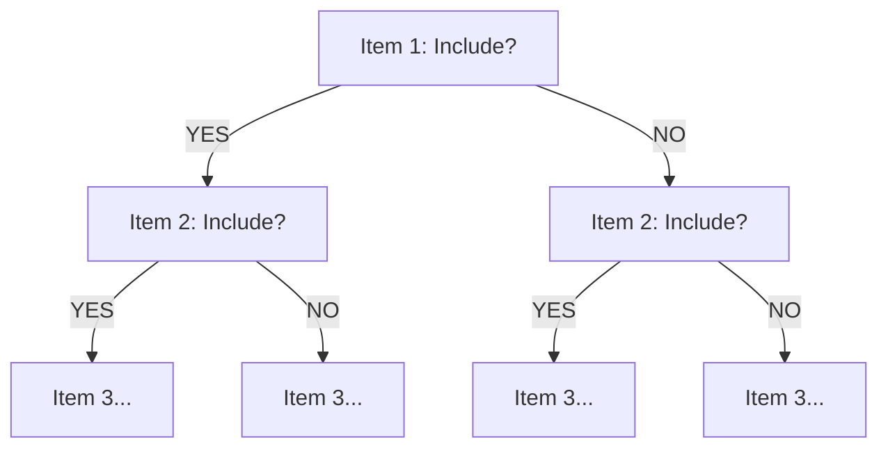
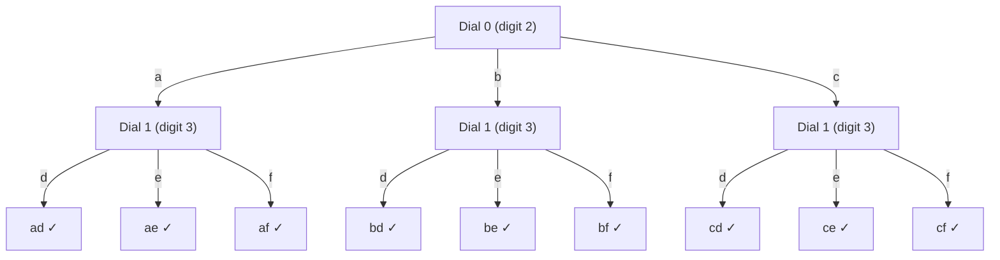

# The Backtracking Playbook: Seven Core Patterns
### A First-Principles Blueprint for Depth, Breadth, and State-Space Pruning

--

# INDEX — Quick Navigation

## Core Concepts
| Section | Description |
|-----|-------|
| [The One Sentence That Unlocks Everything](#the-one-sentence-that-unlocks-everything) | The core insight |
| [The Mental Model: Two Questions](#the-mental-model-two-questions-every-single-time) | What to ask before coding |
| [The Golden Rule: Undo Must Mirror Do](#the-golden-rule-the-undo-must-mirror-the-do) | Non-negotiable rule |
| [The Master Blueprint](#the-master-blueprint-the-universal-backtracking-engine) | Universal engine |

## Patterns (1-10)
| # | Pattern | LeetCode | Key Technique |
|--|-----|-----|--------|
| 1 | [Subsets (Power Set)](#pattern-1-subsets-power-set) | 78 | Include/Exclude |
| 2 | [Combination Sum](#pattern-2-combination-sum-running-budget-unbounded-reuse) | 39 | Reuse allowed |
| 3 | [Permutations](#pattern-3-permutations-the-slot-filling-pool-search-model) | 46 | Used array |
| 4 | [Generate Parentheses](#pattern-4-generate-parentheses-prefix-balance-quota-model) | 22 | Open/Close balance |
| 5 | [Letter Combinations](#pattern-5-letter-combinations-of-a-phone-number-multi-dial-lock) | 17 | Multiple pools |
| 6 | [Palindrome Partitioning](#pattern-6-palindrome-partitioning-the-ribbon-knife-cutter) | 131 | Substring slicing |
| 7 | [Restore IP Addresses](#pattern-7-restore-ip-addresses-depth-bounded-ribbon-cutter) | 93 | Constraint pruning |
| 8 | [Word Search](#pattern-8-word-search-lc-79) | 79 | Grid DFS + masking |
| 9 | [N-Queens](#pattern-9-n-queens-lc-51-n-queens-ii-lc-52) | 51/52 | Diagonal tracking |
| 10 | [Sudoku Solver](#pattern-10-sudoku-solver-lc-37) | 37 | Boolean early exit |
| 11 | [Partition K Equal Sum](#pattern-11-partition-to-k-equal-sum-subsets-lc-698-matchsticks-to-square-lc-473) | 698/473 | Sort DESC + bucket pruning |
| 12 | [Expression Add Operators](#pattern-12-expression-add-operators-lc-282) | 282 | Prev tracking for multiply |

## Reference Sections
| Section | Description |
|-----|-------|
| [Master Comparison Table](#master-comparison-table-plain-english) | All patterns side-by-side |
| [The Ultimate Cheat Sheet](#the-ultimate-cheat-sheet-pattern-recognition-in-10-seconds) | 10-second pattern recognition |
| [The 5 Most Common Mistakes](#the-5-most-common-mistakes-and-how-to-avoid-them) | Avoid these traps |
| [How to Explain in Interview](#how-to-explain-your-solution-in-an-interview) | Communication template |
| [Mastery Checklist](#youve-mastered-backtracking-when-you-can) | Self-assessment |
| [Pattern Family Tree](#the-pattern-family-tree) | How patterns relate |

--

## The "One Sentence That Unlocks Everything"

> **Backtracking is just "try everything, but be smart about undoing your mistakes."**

Think of it like this: You're filling out a form with multiple blanks. For each blank, you try every possible answer. If you realize later that your choice made the form invalid, you **erase** that answer and try the next one. That's it. That's backtracking.

--

## The Mental Model: Two Questions, Every Single Time

Before writing ANY backtracking code, ask yourself:

### Question 1: "What am I filling in?"
This is your **SLOT** (the vertical axis — going deeper)
- Subsets: "Should item #3 be in my bag?"
- Permutations: "Who sits in chair #2?"
- Combination Sum: "What coin do I insert next?"
- Parentheses: "What character goes in position #4?"

### Question 2: "What are my choices for this slot?"
This is your **CANDIDATE POOL** (the horizontal axis — trying alternatives)
- Subsets: Just 2 choices → Include or Exclude
- Permutations: Anyone not already seated
- Combination Sum: Any coin I haven't permanently rejected
- Parentheses: `(` or `)` depending on balance rules

**The entire pattern emerges from these two questions.**

--

## The Golden Rule: The "Undo" Must Mirror the "Do"

```
Whatever you ADD before recursing, you REMOVE after returning.
Whatever you MARK before recursing, you UNMARK after returning.
```

This is non-negotiable. If you forget this, your algorithm is broken.

--

## The Master Blueprint: The Universal Backtracking Engine

Every backtracking algorithm is an exhaustive walk through an implicit directed acyclic graph known as a **State-Space Tree**. 

To master backtracking without memorizing boilerplate code, you must separate **mechanical syntax** from **state invariants**. The engine always operates across two orthogonal axes:

```text
                     Current Decision Frame: Level K
                                    |
          +-------------+-------------+
          |                                                   |
   VERTICAL VECTOR (↓)                                 HORIZONTAL VECTOR (→)
   "Progress through Time / Slots"                     "Test Alternate Realities"
   - Commit candidate to shared state                  - Reject candidate for THIS slot
   - Problem size strictly shrinks                     - Problem level stays IDENTICAL
   - Descend toward leaf / base case                   - Advance candidate pointer sideways
          |                                                   |
   BASE CASE HIT / PRUNED DEAD END                            |
          |                                                   |
   UNCHOOSE (The Backtrack)                                   |
   - Invert the exact mutation done in Choose                 |
   - Slate restored to 100% identical state                   |
          +--------------------------+
```

### The Four Universal Rules

#### 1. Going Down (↓ — Commit & Shrink)
* **What it means:** You make a choice for the current slot.
* **What you do:** You change the shared data (`path.add(item)`, `builder.append(c)`, or `used[i] = true`).
* **The problem gets smaller:** You move to the next slot, reduce the target, or advance the boundary. This is what guarantees you'll eventually stop.

#### 2. Going Sideways (→ — Reject & Shift)
* **What it means:** You're trying a **different choice for the same slot**.
* **Key point:** You do **not** move forward in the problem. The slot stays the same.
* **Why the path must be clean:** Since you're testing an alternate reality for the same position, `path` must not have leftover stuff from the previous attempt.

#### 3. The Undo Rule (The Mirror Law)
* **Backtracking happens automatically** when the function returns and the call stack unwinds.
* **The Rule:** Whatever you did before going down, you must UNDO right after coming back up:
  $$\text{Do something} \implies \text{Go down} \implies \text{Undo that thing}$$
* If you add something, remove it. If you mark something true, mark it false. If you add 1, subtract 1.

#### 4. Where to Start Looking: Forward vs. Reset to 0
This is where most people get confused:
* **Forward Only (start from `i + 1` or `i`):** Use when **order doesn't matter** (Subsets, Combinations). You only look at items ahead. This prevents duplicates like [3, 2] when [2, 3] already exists.
* **Reset to 0:** Use when **order matters** (Permutations) or when **each slot has its own pool** (Phone Keypad). You need to look at ALL items again, using `used[]` to skip items already picked.

--

## Pattern 1: Subsets (Power Set)

### Pattern Recognition Signal

**When you see:** "all subsets", "power set", "all combinations", "include or exclude"

**Instant thought:** "Binary choice per element! Take or skip each item!"

--

### The Mental Model (Before Coding!)

#### What's the problem REALLY asking?

```
Input: [1, 2, 3]

Generate ALL possible subsets:
[], [1], [2], [3], [1,2], [1,3], [2,3], [1,2,3]

That's 2³ = 8 subsets (including empty set)
```

#### The Marie Kondo Analogy

```
You're cleaning your closet. You pick up each item ONE TIME and ask:

"Does this spark joy?"
  YES → Put it in the donation bag (INCLUDE)
  NO  → Leave it on the shelf (EXCLUDE)

You never pick up the same item twice!
Each item gets exactly ONE binary decision.



**Each item = Binary choice (YES/NO). Total paths = 2^n**
```

#### Why 2^n Subsets?

```
Each element has 2 choices: IN or OUT

For n elements:
  2 × 2 × 2 × ... × 2 (n times) = 2^n

[1, 2, 3]:
  1: IN/OUT (2 choices)
  2: IN/OUT (2 choices)
  3: IN/OUT (2 choices)
  Total: 2 × 2 × 2 = 8 subsets
```

#### The Algorithm in Plain English

```
1. Start with empty path and index 0
2. BASE CASE: If index == n, we've decided on all items
   → Add current path to results
3. RECURSIVE CASE: For current item at index:
   a. INCLUDE: Add to path, recurse with index+1, then REMOVE (undo!)
   b. EXCLUDE: Just recurse with index+1 (don't add anything)
```

--

### Visual Dry Run (Decision Tree)

**Input:** `[1, 2]`

```
                        []
                       /  \
                 TAKE 1    SKIP 1
                    /        \
                  [1]        []
                 /  \       /  \
           TAKE 2  SKIP 2  TAKE 2  SKIP 2
              /      \       /       \
           [1,2]    [1]    [2]       []
             ↓       ↓      ↓         ↓
          RESULT  RESULT  RESULT   RESULT

Results: [[], [2], [1], [1,2]]
```

**Step-by-step trace:**

```
===========================================================

Call: recurse(index=0, path=[])

  index=0 < 2, not base case
  
  BRANCH 1: TAKE nums[0]=1
    path.add(1) → path=[1]
    recurse(index=1, path=[1])
    
===========================================================

    Call: recurse(index=1, path=[1])
    
      BRANCH 1: TAKE nums[1]=2
        path.add(2) → path=[1,2]
        recurse(index=2, path=[1,2])
        
===========================================================

        Call: recurse(index=2, path=[1,2])
        
          index=2 == 2, BASE CASE!
          result.add([1,2]) ✓
          return
          
===========================================================

        Back to: recurse(index=1, path=[1,2])
        path.remove(2) → path=[1]  // UNDO!
        
      BRANCH 2: SKIP nums[1]=2
        recurse(index=2, path=[1])
        
===========================================================

        Call: recurse(index=2, path=[1])
        
          index=2 == 2, BASE CASE!
          result.add([1]) ✓
          return
          
===========================================================

    Back to: recurse(index=0, path=[1])
    path.remove(1) → path=[]  // UNDO!
    
  BRANCH 2: SKIP nums[0]=1
    recurse(index=1, path=[])
    
    ... (similar process, adds [2] and [])

===========================================================

Final results: [[], [2], [1], [1,2]] ✓
```

--

### The Code (With Line-by-Line Explanation)

```java
public List<List<Integer>> subsets(int[] nums) {
    List<List<Integer>> result = new ArrayList<>();
    backtrack(nums, 0, new ArrayList<>(), result);
    return result;
}

private void backtrack(int[] nums, int index, List<Integer> path, 
                       List<List<Integer>> result) {
    // BASE CASE: We've decided on all items
    if (index == nums.length) {
        result.add(new ArrayList<>(path));  // Save a COPY!
        return;
    }
    
    // ==========================================
    // BRANCH 1: INCLUDE this item
    // ==========================================
    path.add(nums[index]);                    // 1. DO: Add item
    backtrack(nums, index + 1, path, result); // 2. RECURSE: Decide on rest
    path.remove(path.size() - 1);             // 3. UNDO: Remove item
    
    // ==========================================
    // BRANCH 2: EXCLUDE this item
    // ==========================================
    backtrack(nums, index + 1, path, result); // Just move on, don't add
}
```

--

### The Golden Rule: UNDO Must Mirror DO

```java
// Whatever you DO before recursing...
path.add(nums[index]);        // DO: Add item
backtrack(...);               // RECURSE
path.remove(path.size() - 1); // UNDO: Remove item (MUST mirror the DO!)

// If you forget the UNDO, your path accumulates garbage!
```

--

### Why `new ArrayList<>(path)`?

```java
// ❌ WRONG: Adding the same list reference
result.add(path);  // All entries point to SAME list!

// ✅ CORRECT: Adding a COPY
result.add(new ArrayList<>(path));  // Each entry is independent

// Why? Because path keeps changing as we backtrack.
// If we don't copy, all results will be the final state of path!
```

--

### Common Traps

| Trap | Why Wrong | Fix |
|---|------|---|
| Not copying path | All results point to same list | `new ArrayList<>(path)` |
| Forgetting UNDO | Path accumulates garbage | Always remove after recurse |
| Wrong base case | Miss subsets or infinite loop | `index == nums.length` |

--

### Mind-Map Anchor

```
SUBSETS (POWER SET)
        |
        ▼
+-------------------------+
| Binary choice per item  |
| TAKE: add, recurse, undo|
| SKIP: just recurse      |
| Base: index == n        |
| Copy path to result!    |
| 2^n total subsets       |
+-------------------------+
```

**Memory phrase:** "Take or skip each item, undo after recursing, copy to result"

--
}
```

### Execution Trace: `nums = [1, 2]`
```text
Root: recurse(idx=0) | path=[]
|
+-- TAKE 1: path=[1]
|   +-- recurse(idx=1) | path=[1]
|       +-- TAKE 2: path=[1, 2]
|       |   +-- recurse(idx=2) -> DONE! Save [1, 2]
|       +-- UNDO: Remove 2 -> path=[1]
|       +-- SKIP 2:
|           +-- recurse(idx=2) -> DONE! Save [1]
|
+-- UNDO: Remove 1 -> path=[]
+-- SKIP 1:
    +-- recurse(idx=1) | path=[]
        +-- TAKE 2: path=[2]
        |   +-- recurse(idx=2) -> DONE! Save [2]
        +-- UNDO: Remove 2 -> path=[]
        +-- SKIP 2:
            +-- recurse(idx=2) -> DONE! Save []

Final Result: [[1, 2], [1], [2], []] (Total: 2^2 = 4 subsets)
```

--

## Pattern 2: Combination Sum (Running Budget & Unbounded Reuse)

### Pattern Recognition Signal

**When you see:** "sum to target", "unlimited use of elements", "coin change", "ways to reach a total"

**Instant thought:** "Budget shrinks, position can stay → Combination Sum pattern!"

--

### The Mental Model (Before Coding!)

#### What's the problem REALLY asking?

```
Input: candidates = [2, 3], target = 5

Find ALL combinations that sum to exactly 5.
Each number can be used UNLIMITED times.

Output: [[2, 3]] (because 2 + 3 = 5)
        Note: [2, 2] = 4 (not enough), [3, 3] = 6 (too much)
```

#### The Vending Machine Analogy

```
You're at a vending machine. The snack costs $5.
You have unlimited coins: $2 and $3 denominations.

At each step, you ask:
  "Do I insert this coin AGAIN?"  → Stay at same coin
  "Or do I GIVE UP on this coin forever?" → Move to next coin

+---------------------------------------------------------+
|                                                          |
|  Budget=$5: Use $2? -+- YES -+- Budget=$3: Use $2? -+-  |
|                      |       |                       |   |
|                      |       |  YES → Budget=$1      |   |
|                      |       |  NO  → Try $3         |   |
|                      |                                   |
|                      +- NO --+- Try $3 coin             |
|                              |                           |
+---------------------------------------------------------+
```

#### Why Backtracking Works Here

```
Key Insight: Unlike Subsets where you move past each item,
here you can STAY on the same coin and use it again!

The "shrinking" happens in your BUDGET, not your position.

index stays → BUT → target shrinks → GUARANTEED termination
```

#### The Algorithm in Plain English

```
1. Start with full budget and index 0
2. BASE CASE: If budget == 0, we hit the target exactly!
   → Add current path to results
3. BASE CASE: If budget < 0 OR no more coins, dead end
   → Return (backtrack)
4. RECURSIVE CASE: For current coin at index:
   a. USE: Add coin, recurse with SAME index (reuse!), then REMOVE (undo!)
   b. SKIP: Recurse with index+1 (never use this coin again)
```

--

### Visual Dry Run (Decision Tree)

**Input:** `candidates = [2, 3]`, `target = 5`

```
                           budget=5
                          /        \
                    USE $2          SKIP $2
                      |                |
                  budget=3          budget=5
                   path=[2]         path=[]
                  /       \            |
            USE $2      SKIP $2     USE $3
              |            |           |
          budget=1     budget=3    budget=2
         path=[2,2]    path=[2]    path=[3]
            |             |           |
         USE $2        USE $3      USE $3
            |             |           |
        budget=-1     budget=0    budget=-1
           ❌           ✅           ❌
        OVER!       EXACT HIT!     OVER!
                   Save [2,3]
```

**Step-by-step trace:**

```
===========================================================

Call: recurse(index=0, budget=5, path=[])

  budget=5 > 0, not base case
  
  BRANCH 1: USE coin $2
    path.add(2) → path=[2]
    recurse(index=0, budget=3, path=[2])  // STAY at same index!
    
===========================================================

    Call: recurse(index=0, budget=3, path=[2])
    
      BRANCH 1: USE coin $2 again
        path.add(2) → path=[2,2]
        recurse(index=0, budget=1, path=[2,2])
        
===========================================================

        Call: recurse(index=0, budget=1, path=[2,2])
        
          BRANCH 1: USE coin $2
            path.add(2) → path=[2,2,2]
            recurse(index=0, budget=-1, path=[2,2,2])
            
              budget=-1 < 0, OVER BUDGET! return
              
            path.remove(2) → path=[2,2]  // UNDO!
            
          BRANCH 2: SKIP coin $2, try coin $3
            recurse(index=1, budget=1, path=[2,2])
            
              USE coin $3: budget=1-3=-2 < 0, OVER! return
              SKIP coin $3: index=2 == length, no more coins! return
              
===========================================================

        Back to: recurse(index=0, budget=3, path=[2])
        path.remove(2) → path=[2]  // UNDO!
        
      BRANCH 2: SKIP coin $2, try coin $3
        recurse(index=1, budget=3, path=[2])
        
          USE coin $3: budget=3-3=0 → EXACT HIT!
          result.add([2,3]) ✓
          
===========================================================

Final results: [[2, 3]] ✓
```

--

### The Code (With Line-by-Line Explanation)

```java
public List<List<Integer>> combinationSum(int[] candidates, int target) {
    List<List<Integer>> result = new ArrayList<>();
    backtrack(candidates, 0, target, new ArrayList<>(), result);
    return result;
}

private void backtrack(int[] candidates, int index, int target, 
                       List<Integer> path, List<List<Integer>> result) {
    // BASE CASE: We hit the target exactly!
    if (target == 0) {
        result.add(new ArrayList<>(path));  // Copy! Don't forget!
        return;
    }
    
    // BASE CASE: Over budget OR ran out of coins
    if (target < 0 || index == candidates.length) {
        return;  // Dead end, backtrack
    }
    
    // ==========================================
    // BRANCH 1: USE this coin (and maybe use it again!)
    // ==========================================
    path.add(candidates[index]);                              // 1. DO: Add coin
    backtrack(candidates, index, target - candidates[index],  // 2. RECURSE: STAY at same index!
              path, result);                                  //    (This is the reuse trick!)
    path.remove(path.size() - 1);                             // 3. UNDO: Remove coin
    
    // ==========================================
    // BRANCH 2: SKIP this coin forever
    // ==========================================
    backtrack(candidates, index + 1, target, path, result);   // Move to next coin
}
```

--

### The Golden Rule: UNDO Must Mirror DO

```java
// Whatever you DO before recursing...
path.add(candidates[index]);                    // DO: Add coin
backtrack(candidates, index, target - val, ...); // RECURSE
path.remove(path.size() - 1);                   // UNDO: Remove coin

// The KEY difference from Subsets:
// We pass 'index' (same), not 'index + 1' (next)
// This allows REUSE of the same coin!
```

--

### Why `index` stays the same (Reuse) vs `index + 1` (No Reuse)?

```java
// Combination Sum I: UNLIMITED reuse
backtrack(candidates, index, target - val, ...);  // Stay at same index
//                    ^^^^^ SAME index = can use this coin again

// Combination Sum II: SINGLE use only
backtrack(candidates, index + 1, target - val, ...);  // Move forward
//                    ^^^^^^^^^ NEXT index = can't reuse this coin
```

--

### Common Traps

| Trap | Why Wrong | Fix |
|---|------|---|
| Using `index + 1` for reuse | Can't use same coin twice | Use `index` (stay) for unlimited reuse |
| Forgetting `target < 0` check | Infinite recursion | Add base case for over-budget |
| Not copying path | All results point to same list | `new ArrayList<>(path)` |
| Forgetting UNDO | Path accumulates garbage | Always remove after recurse |

--

### Mind-Map Anchor

```
COMBINATION SUM
       |
       ▼
+-------------------------+
| Budget shrinks, not pos |
| USE: stay at index      |
| SKIP: move to index+1   |
| Base: target==0 (hit!)  |
| Base: target<0 (over!)  |
| Copy path to result!    |
+-------------------------+
```

**Memory phrase:** "Stay to reuse, move to refuse, budget always shrinks"

--

### The Trap: Combination Sum II (Single-Use with Duplicates)

**The Shift:** Each number can only be used ONCE, but input may have duplicates like `[1, 1, 2, 5, 6, 7, 10]`.

**The Mental Model:**
```
Combination Sum I:  "Stay at index" (reuse allowed)
Combination Sum II: "Move to index + 1" (no reuse) + "Skip duplicate twins"
```

**The Code Changes:**
```java
// Change 1: Move forward after using (no reuse)
recurse(candidates, index + 1, target - candidates[index], path, result);
//                   ^^^^^^^^^ was just 'index' in Combination Sum I

// Change 2: Skip duplicate values at same level
if (i > start && candidates[i] == candidates[i-1]) continue;
```

--

## Pattern 3: Permutations (The Slot-Filling & Pool Search Model)

### Pattern Recognition Signal

**When you see:** "all arrangements", "all orderings", "permutations", "order matters"

**Instant thought:** "Reset to 0 + used[] bouncer → Permutations pattern!"

--

### The Mental Model (Before Coding!)

#### What's the problem REALLY asking?

```
Input: [1, 2, 3]

Generate ALL possible orderings:
[1,2,3], [1,3,2], [2,1,3], [2,3,1], [3,1,2], [3,2,1]

That's 3! = 6 permutations

Key: [1,2] and [2,1] are DIFFERENT (order matters!)
```

#### The Wedding Seating Analogy

```
You're a wedding planner assigning seats.
You have 3 guests (Alice, Bob, Carol) and 3 chairs.

For Chair 1: ANYONE can sit
For Chair 2: Anyone EXCEPT whoever is already seated
For Chair 3: Only one person is left

+---------------------------------------------------------+
|                                                          |
|  Chair 1: Who sits? -+- Alice -+- Chair 2: Who sits?    |
|                      |         |  (Alice is TAKEN)       |
|                      |         |  Bob or Carol?          |
|                      |                                   |
|                      +- Bob ---+- Chair 2: Who sits?    |
|                      |         |  (Bob is TAKEN)         |
|                      |         |  Alice or Carol?        |
|                      |                                   |
|                      +- Carol -+- Chair 2: Who sits?    |
|                                |  (Carol is TAKEN)       |
|                                |  Alice or Bob?          |
+---------------------------------------------------------+
```

#### Why Reset to 0? (The Critical Insight!)

```
Subsets:      [1, 2] and [2, 1] are the SAME subset
              → Go forward only to avoid duplicates

Permutations: [1, 2] and [2, 1] are DIFFERENT permutations
              → Must be able to go BACKWARD!

If Chair 0 picks element at index 1 (value 2),
Chair 1 MUST be able to look at index 0 (value 1) to create [2, 1].

That's why we RESET to 0 for each new chair!
```

#### The Algorithm in Plain English

```
1. Start with empty path and chair 0
2. BASE CASE: If all chairs filled (path.size == n)
   → Add current arrangement to results
3. RECURSIVE CASE: For current chair:
   a. Scan ALL candidates from index 0
   b. For each candidate NOT already used:
      - Mark as used, add to path
      - Recurse for next chair (reset scan to 0!)
      - UNDO: Remove from path, unmark as used
```

--

### Visual Dry Run (Decision Tree)

**Input:** `[1, 2]`

```
                        []
                       /  \
                 SEAT 1    SEAT 2
                (Chair 0)  (Chair 0)
                    |          |
                  [1]        [2]
                   |          |
              SEAT 2      SEAT 1
             (Chair 1)   (Chair 1)
                 |          |
              [1,2]      [2,1]
                ↓          ↓
             RESULT     RESULT

Results: [[1, 2], [2, 1]]
```

**Step-by-step trace:**

```
===========================================================

Call: backtrack(path=[], used=[F,F])

  path.size=0 < 2, not base case
  
  Scan from index 0:
  
  i=0: nums[0]=1, used[0]=false → CAN USE!
    used[0]=true, path.add(1) → path=[1], used=[T,F]
    backtrack(path=[1], used=[T,F])  // Next chair, RESET to i=0!
    
===========================================================

    Call: backtrack(path=[1], used=[T,F])
    
      Scan from index 0 (RESET!):
      
      i=0: nums[0]=1, used[0]=true → SKIP (already seated!)
      
      i=1: nums[1]=2, used[1]=false → CAN USE!
        used[1]=true, path.add(2) → path=[1,2], used=[T,T]
        backtrack(path=[1,2], used=[T,T])
        
===========================================================

        Call: backtrack(path=[1,2], used=[T,T])
        
          path.size=2 == 2, BASE CASE!
          result.add([1,2]) ✓
          return
          
===========================================================

        Back to: backtrack(path=[1,2], used=[T,T])
        path.remove(2) → path=[1]  // UNDO!
        used[1]=false → used=[T,F]  // UNDO!
        
      No more candidates for Chair 1
      return
      
===========================================================

    Back to: backtrack(path=[1], used=[T,F])
    path.remove(1) → path=[]  // UNDO!
    used[0]=false → used=[F,F]  // UNDO!
    
  i=1: nums[1]=2, used[1]=false → CAN USE!
    used[1]=true, path.add(2) → path=[2], used=[F,T]
    backtrack(path=[2], used=[F,T])  // Next chair, RESET to i=0!
    
===========================================================

    Call: backtrack(path=[2], used=[F,T])
    
      Scan from index 0 (RESET!):
      
      i=0: nums[0]=1, used[0]=false → CAN USE!
        used[0]=true, path.add(1) → path=[2,1], used=[T,T]
        backtrack(path=[2,1], used=[T,T])
        
          path.size=2 == 2, BASE CASE!
          result.add([2,1]) ✓
          
===========================================================

Final results: [[1, 2], [2, 1]] ✓
```

--

### The Code (With Line-by-Line Explanation)

```java
public List<List<Integer>> permute(int[] nums) {
    List<List<Integer>> result = new ArrayList<>();
    boolean[] used = new boolean[nums.length];  // The "bouncer" array
    backtrack(nums, used, new ArrayList<>(), result);
    return result;
}

private void backtrack(int[] nums, boolean[] used, 
                       List<Integer> path, List<List<Integer>> result) {
    // BASE CASE: All chairs are filled!
    if (path.size() == nums.length) {
        result.add(new ArrayList<>(path));  // Copy! Don't forget!
        return;
    }
    
    // Try EVERY candidate (reset to 0 each time!)
    for (int i = 0; i < nums.length; i++) {
        // Skip if this person is already seated
        if (used[i]) continue;  // The "bouncer" check
        
        // ==========================================
        // DO: Seat this person
        // ==========================================
        used[i] = true;           // Mark as seated
        path.add(nums[i]);        // Add to arrangement
        
        // ==========================================
        // RECURSE: Fill next chair (loop resets to 0!)
        // ==========================================
        backtrack(nums, used, path, result);
        
        // ==========================================
        // UNDO: Remove this person (try someone else)
        // ==========================================
        path.remove(path.size() - 1);  // Remove from arrangement
        used[i] = false;               // Unmark (free the seat)
    }
}
```

--

### The Golden Rule: UNDO Must Mirror DO (TWO things to undo!)

```java
// In Permutations, you DO two things:
used[i] = true;           // 1. Mark as used
path.add(nums[i]);        // 2. Add to path

backtrack(...);           // RECURSE

// So you must UNDO two things:
path.remove(path.size() - 1);  // 1. Remove from path
used[i] = false;               // 2. Unmark as used

// Forgetting EITHER undo breaks the algorithm!
```

--

### Why `used[]` Array? (The Bouncer Analogy)

```java
// Without used[], you'd seat the same person twice!
// path = [1, 1, 1] ← WRONG! Person 1 can't sit in 3 chairs!

// The used[] array is like a bouncer at a club:
// "Sorry, you're already inside. Can't enter again."

for (int i = 0; i < nums.length; i++) {
    if (used[i]) continue;  // "You're already seated, next!"
    // ...
}
```

--

### Common Traps

| Trap | Why Wrong | Fix |
|---|------|---|
| Forgetting `used[]` array | Same element used multiple times | Add `boolean[] used` |
| Not resetting to 0 | Miss permutations like [2,1] | Loop always starts at i=0 |
| Only undoing path | `used[]` stays corrupted | Undo BOTH: path AND used |
| Not copying path | All results point to same list | `new ArrayList<>(path)` |

--

### Mind-Map Anchor

```
PERMUTATIONS
      |
      ▼
+-------------------------+
| Order MATTERS!          |
| Reset to 0 each level   |
| used[] = bouncer array  |
| DO: mark + add          |
| UNDO: remove + unmark   |
| Base: path.size == n    |
| n! total permutations   |
+-------------------------+
```

**Memory phrase:** "Reset to zero, bouncer says no, undo both mark and add"

--

### The Trap: Permutations II (Duplicates)

**The Problem:** Input `[1, 1, 2]` — you'll generate `[1a, 1b, 2]` and `[1b, 1a, 2]` which are identical!

**The Mental Model — The "Older Sibling Rule":**
```
If you have twins (1a and 1b), the younger twin (1b) can only sit 
if the older twin (1a) is ALREADY SEATED in the current arrangement.

Why? If 1a is NOT seated but you pick 1b, you're creating the same 
arrangement that would happen if you picked 1a instead.
```

**The Code Pattern:**
```java
// Sort to group twins together
Arrays.sort(nums);

// The Older Sibling Rule
if (i > 0 && nums[i] == nums[i-1] && !used[i-1]) continue;
//                                   ^^^^^^^^^^^
// "If my older twin is NOT seated, I can't sit either"
```

**Why `!used[i-1]`?**
- If `used[i-1] == true`: Older twin IS seated → younger twin CAN sit (they're in different chairs)
- If `used[i-1] == false`: Older twin is NOT seated → younger twin CANNOT sit (would create duplicate)

--

## Pattern 4: Generate Parentheses (Prefix Balance & Quota Model)

### Pattern Recognition Signal

**When you see:** "generate valid sequences", "balanced brackets/parentheses", "valid expressions", "Catalan number"

**Instant thought:** "Two counters (open/close) with balance constraint → Parentheses pattern!"

--

### The Mental Model (Before Coding!)

#### What's the problem REALLY asking?

```
Input: n = 2

Generate ALL valid combinations of n pairs of parentheses.

Output: ["(())", "()()"]

Invalid examples: ")(" (close before open), "(()" (unbalanced)
```

#### The Credit Card Analogy

```
'(' = Spending money (creating debt)
')' = Paying off debt

You can SPEND if you have credit limit left (open < n)
You can PAY ONLY if you have debt to pay (close < open)
You can't pay off debt you don't have!

+---------------------------------------------------------+
|                                                          |
|  Position 0: Can spend? -+- YES (open<n) → "("          |
|                          |   debt=1                      |
|                          |                               |
|                          +- NO (close<open fails)        |
|                              Can't pay debt you don't    |
|                              have!                       |
|                                                          |
|  Position 1: Can spend? -+- YES (open<n) → "(("         |
|              Can pay?    |   debt=2                      |
|                          |                               |
|                          +- YES (close<open) → "()"     |
|                              debt=0                      |
+---------------------------------------------------------+
```

#### The Two Rules That Govern Everything

```
Rule 1: You can add '(' if you haven't used up your quota
        → open < n

Rule 2: You can add ')' ONLY if there's an unmatched '(' to close
        → close < open

These two rules GUARANTEE every generated string is valid!
```

#### The Algorithm in Plain English

```
1. Start with empty string, open=0, close=0
2. BASE CASE: If length == 2*n, we've filled all positions
   → Add current string to results
3. RECURSIVE CASE: For current position:
   a. If open < n: Add '(', recurse with open+1, then REMOVE (undo!)
   b. If close < open: Add ')', recurse with close+1, then REMOVE (undo!)
```

--

### Visual Dry Run (Decision Tree)

**Input:** `n = 2`

```
                           ""
                          /
                        "("
                       /    \
                    "(("    "()"
                    /         \
                 "(()"       "()()"
                  /             ↓
               "(())"        RESULT
                  ↓
               RESULT

Results: ["(())", "()()"]
```

**Step-by-step trace:**

```
===========================================================

Call: backtrack(path="", open=0, close=0)

  length=0 < 4, not base case
  
  Can add '('? open=0 < n=2 → YES!
    path.append('(') → path="("
    backtrack(path="(", open=1, close=0)
    
===========================================================

    Call: backtrack(path="(", open=1, close=0)
    
      Can add '('? open=1 < n=2 → YES!
        path.append('(') → path="(("
        backtrack(path="((", open=2, close=0)
        
===========================================================

        Call: backtrack(path="((", open=2, close=0)
        
          Can add '('? open=2 < n=2 → NO! (quota exhausted)
          
          Can add ')'? close=0 < open=2 → YES!
            path.append(')') → path="(()"
            backtrack(path="(()", open=2, close=1)
            
===========================================================

            Call: backtrack(path="(()", open=2, close=1)
            
              Can add '('? open=2 < n=2 → NO!
              
              Can add ')'? close=1 < open=2 → YES!
                path.append(')') → path="(())"
                backtrack(path="(())", open=2, close=2)
                
                  length=4 == 4, BASE CASE!
                  result.add("(())") ✓
                  return
                  
                path.deleteCharAt() → path="(()"  // UNDO!
                
===========================================================

        Back to: backtrack(path="((", open=2, close=0)
        path.deleteCharAt() → path="("  // UNDO!
        
===========================================================

    Back to: backtrack(path="(", open=1, close=0)
    path.deleteCharAt() → path=""  // UNDO!
    
      Can add ')'? close=0 < open=1 → YES!
        path.append(')') → path="()"
        backtrack(path="()", open=1, close=1)
        
===========================================================

        Call: backtrack(path="()", open=1, close=1)
        
          Can add '('? open=1 < n=2 → YES!
            path.append('(') → path="()("
            backtrack(path="()(", open=2, close=1)
            
              Can add ')'? close=1 < open=2 → YES!
                path.append(')') → path="()()"
                
                  length=4 == 4, BASE CASE!
                  result.add("()()") ✓
                  
===========================================================

Final results: ["(())", "()()"] ✓
```

--

### The Code (With Line-by-Line Explanation)

```java
public List<String> generateParenthesis(int n) {
    List<String> result = new ArrayList<>();
    backtrack(n, 0, 0, new StringBuilder(), result);
    return result;
}

private void backtrack(int n, int open, int close, 
                       StringBuilder path, List<String> result) {
    // BASE CASE: We've filled all 2n positions!
    if (path.length() == 2 * n) {
        result.add(path.toString());  // StringBuilder → String
        return;
    }
    
    // ==========================================
    // BRANCH 1: Try adding '(' if we have quota left
    // ==========================================
    if (open < n) {
        path.append('(');                              // 1. DO: Add '('
        backtrack(n, open + 1, close, path, result);   // 2. RECURSE: Increment open
        path.deleteCharAt(path.length() - 1);          // 3. UNDO: Remove '('
    }
    
    // ==========================================
    // BRANCH 2: Try adding ')' if there's unmatched '('
    // ==========================================
    if (close < open) {
        path.append(')');                              // 1. DO: Add ')'
        backtrack(n, open, close + 1, path, result);   // 2. RECURSE: Increment close
        path.deleteCharAt(path.length() - 1);          // 3. UNDO: Remove ')'
    }
}
```

--

### The Golden Rule: BOTH Branches Must UNDO!

```java
// In Subsets: Only INCLUDE branch adds, so only INCLUDE undoes
// In Parentheses: BOTH branches add something!

// Branch 1 adds '('
path.append('(');
backtrack(...);
path.deleteCharAt(path.length() - 1);  // UNDO!

// Branch 2 adds ')'
path.append(')');
backtrack(...);
path.deleteCharAt(path.length() - 1);  // UNDO!

// Both branches ADD, so both branches must UNDO!
```

--

### Why `close < open` and not `close < n`?

```java
// ❌ WRONG: close < n
// This would allow ")(" which is INVALID!
// At position 0: close=0 < n=2 → adds ')' → WRONG!

// ✅ CORRECT: close < open
// This ensures every ')' has a matching '(' before it
// At position 0: close=0 < open=0 → FALSE → can't add ')' → CORRECT!

// The invariant: At every position, open >= close
// This guarantees the string is valid at every step!
```

--

### Common Traps

| Trap | Why Wrong | Fix |
|---|------|---|
| Using `close < n` | Allows invalid sequences like ")(" | Use `close < open` |
| Forgetting UNDO in both branches | Path accumulates garbage | Both branches must undo |
| Using `path.length() == n` | Only half the string | Use `path.length() == 2 * n` |
| Not converting StringBuilder | Result contains StringBuilder refs | Use `path.toString()` |

--

### Mind-Map Anchor

```
GENERATE PARENTHESES
         |
         ▼
+-------------------------+
| Two counters: open/close|
| '(' if open < n         |
| ')' if close < open     |
| BOTH branches undo!     |
| Base: length == 2*n     |
| Catalan number results  |
+-------------------------+
```

**Memory phrase:** "Open if quota left, close if debt exists, undo both branches"

--

### The Trap: Multiple Bracket Types

**The Problem:** With `()`, `[]`, `{}`, simple counters fail because `"[)"` has balanced counts but invalid nesting!

**The Solution:** Replace counters with an explicit **stack** to track which bracket type needs closing.

```java
// Instead of: if (close < open)
// Use: if (!stack.isEmpty() && stack.peek() matches currentCloser)

// Stack tracks WHICH type of bracket needs closing
// '(' pushed → only ')' can pop it
// '[' pushed → only ']' can pop it
```

---

## Pattern 5: Letter Combinations of a Phone Number (Multi-Dial Lock)

### Pattern Recognition Signal

**When you see:** "each position has different choices", "Cartesian product", "phone number to words", "independent pools per slot"

**Instant thought:** "Independent pools + reset to 0 → Phone Keypad pattern!"

--

### The Mental Model (Before Coding!)

#### What's the problem REALLY asking?

```
Input: digits = "23"

Digit 2 → "abc"
Digit 3 → "def"

Generate ALL combinations: one letter from each digit's pool.

Output: ["ad", "ae", "af", "bd", "be", "bf", "cd", "ce", "cf"]

That's 3 × 3 = 9 combinations (Cartesian product)
```

#### The Combination Lock Analogy

You're cracking a combination lock with multiple dials.
Each dial has DIFFERENT symbols!

- **Dial 0 (digit 2):** a, b, c
- **Dial 1 (digit 3):** d, e, f

For each dial, you try every symbol.
When you move to the next dial, you START FROM ITS FIRST SYMBOL.



**Each dial has its OWN pool - no need for used[] array!**

#### Why No `used[]` Array? (Key Difference from Permutations!)

```
Permutations: All chairs share the SAME pool
              → Need used[] to prevent reuse
              → Chair 1 picks 'a', Chair 2 can't pick 'a' again

Phone Keypad: Each dial has its OWN INDEPENDENT pool
              → NO overlap between pools!
              → Dial 0 pool is "abc", Dial 1 pool is "def"
              → No need for used[] because pools don't share elements
```

#### The Algorithm in Plain English

```
1. Start with empty path and dial 0
2. BASE CASE: If all dials are locked (digitIdx == digits.length)
   → Add current combination to results
3. RECURSIVE CASE: For current dial:
   a. Get the letters for this digit (e.g., "abc" for digit 2)
   b. For each letter in this dial's pool:
      - Add letter to path
      - Recurse for next dial (reset to letter 0 of THAT dial!)
      - REMOVE letter (undo!)
```

--

### Visual Dry Run (Decision Tree)

**Input:** `digits = "23"`

```
                           ""
                    /      |      \
                  "a"     "b"     "c"
                 / | \   / | \   / | \
               ad ae af bd be bf cd ce cf
                ↓  ↓  ↓  ↓  ↓  ↓  ↓  ↓  ↓
               ✓  ✓  ✓  ✓  ✓  ✓  ✓  ✓  ✓

Results: ["ad", "ae", "af", "bd", "be", "bf", "cd", "ce", "cf"]
```

**Step-by-step trace:**

```
===========================================================

Call: backtrack(digitIdx=0, path="")

  digitIdx=0 < 2, not base case
  letters for digit '2' = "abc"
  
  i=0: letter='a'
    path.append('a') → path="a"
    backtrack(digitIdx=1, path="a")  // Next dial!
    
===========================================================

    Call: backtrack(digitIdx=1, path="a")
    
      letters for digit '3' = "def"
      
      i=0: letter='d'
        path.append('d') → path="ad"
        backtrack(digitIdx=2, path="ad")
        
          digitIdx=2 == 2, BASE CASE!
          result.add("ad") ✓
          return
          
        path.deleteCharAt() → path="a"  // UNDO!
        
      i=1: letter='e'
        path.append('e') → path="ae"
        backtrack(digitIdx=2, path="ae")
        
          BASE CASE! result.add("ae") ✓
          
        path.deleteCharAt() → path="a"  // UNDO!
        
      i=2: letter='f'
        path.append('f') → path="af"
        backtrack(digitIdx=2, path="af")
        
          BASE CASE! result.add("af") ✓
          
        path.deleteCharAt() → path="a"  // UNDO!
        
===========================================================

    Back to: backtrack(digitIdx=0, path="a")
    path.deleteCharAt() → path=""  // UNDO!
    
  i=1: letter='b'
    path.append('b') → path="b"
    backtrack(digitIdx=1, path="b")
    
      ... (similar process, adds "bd", "be", "bf")
      
===========================================================

  i=2: letter='c'
    path.append('c') → path="c"
    backtrack(digitIdx=1, path="c")
    
      ... (similar process, adds "cd", "ce", "cf")
      
===========================================================

Final results: ["ad", "ae", "af", "bd", "be", "bf", "cd", "ce", "cf"] ✓
```

--

### The Code (With Line-by-Line Explanation)

```java
private static final String[] KEYPAD = {
    "", "", "abc", "def", "ghi", "jkl", "mno", "pqrs", "tuv", "wxyz"
};  // Index 0-1 are empty (no letters for 0 and 1)

public List<String> letterCombinations(String digits) {
    List<String> result = new ArrayList<>();
    if (digits == null || digits.isEmpty()) return result;  // Edge case!
    backtrack(digits, 0, new StringBuilder(), result);
    return result;
}

private void backtrack(String digits, int digitIdx, 
                       StringBuilder path, List<String> result) {
    // BASE CASE: All dials are locked!
    if (digitIdx == digits.length()) {
        result.add(path.toString());  // StringBuilder → String
        return;
    }
    
    // Get the letters for current digit
    String letters = KEYPAD[digits.charAt(digitIdx) - '0'];
    
    // Try each letter on this dial
    for (int i = 0; i < letters.length(); i++) {
        // ==========================================
        // DO: Lock this letter
        // ==========================================
        path.append(letters.charAt(i));
        
        // ==========================================
        // RECURSE: Move to next dial (starts from letter 0 of THAT dial)
        // ==========================================
        backtrack(digits, digitIdx + 1, path, result);
        
        // ==========================================
        // UNDO: Unlock this letter (try next letter on same dial)
        // ==========================================
        path.deleteCharAt(path.length() - 1);
    }
}
```

--

### The Golden Rule: UNDO Must Mirror DO

```java
// Whatever you DO before recursing...
path.append(letters.charAt(i));     // DO: Add letter
backtrack(digits, digitIdx + 1, ...); // RECURSE: Next dial
path.deleteCharAt(path.length() - 1); // UNDO: Remove letter

// Each dial is independent, so we just move to digitIdx + 1
// No need for used[] because pools don't overlap!
```

--

### Why Reset to Letter 0 of Each Dial?

```java
// When we move to the next dial, we start from ITS first letter
// NOT from where we left off on the previous dial!

// Dial 0 (digit 2): "abc" → we try a, b, c
// Dial 1 (digit 3): "def" → we try d, e, f (starting fresh!)

// This is different from Permutations where we reset to index 0
// of the SAME pool. Here, each dial has its OWN pool.
```

--

### Common Traps

| Trap | Why Wrong | Fix |
|---|------|---|
| Forgetting empty input check | Crashes or returns [""] | Check `digits.isEmpty()` |
| Using `used[]` array | Unnecessary, pools are independent | Remove `used[]` |
| Wrong keypad mapping | Wrong letters for digits | Double-check KEYPAD array |
| Forgetting UNDO | Path accumulates garbage | Always deleteCharAt after recurse |

--

### Mind-Map Anchor

```
PHONE KEYPAD
      |
      ▼
+-------------------------+
| Each dial = own pool    |
| No used[] needed!       |
| Reset to letter 0       |
| of NEXT dial's pool     |
| DO: append letter       |
| UNDO: deleteCharAt      |
| Cartesian product       |
+-------------------------+
```

**Memory phrase:** "Each dial has its own pool, no bouncer needed, reset to first letter"

--

### The Twist: Dictionary Word Filter (Boggle / T9)

**The Problem:** Instead of all combinations, only return valid dictionary words.

**The Optimization:** Use a **Trie** (Prefix Tree) to prune early!

```java
// Before recursing, check if current prefix could lead to a word
if (!trie.startsWith(path.toString())) return; // PRUNE! No word starts with this prefix

// This avoids exploring millions of dead-end combinations!
```

---

## Pattern 6: Palindrome Partitioning (The Ribbon Knife Cutter)

### Pattern Recognition Signal

**When you see:** "partition a string", "split into valid pieces", "all ways to divide", "word break variations"

**Instant thought:** "Contiguous slicing with validation → Partitioning pattern!"

--

### The Mental Model (Before Coding!)

#### What's the problem REALLY asking?

```
Input: s = "aab"

Cut the string into pieces where EVERY piece is a palindrome.

Output: [["a", "a", "b"], ["aa", "b"]]

"a" is palindrome ✓
"aa" is palindrome ✓
"b" is palindrome ✓
"ab" is NOT palindrome ✗ (so ["a", "ab"] is invalid)
```

#### The Sushi Chef Analogy

```
You're a sushi chef cutting a roll. You MUST use the entire roll.
At each position, you decide: "Do I cut here, or do I extend my current piece?"
But you can only cut if the piece you're creating is VALID (palindrome)!

+---------------------------------------------------------+
|                                                          |
|  String: "aab"                                          |
|                                                          |
|  Position 0: Cut after 'a'? -+- "a" is palindrome ✓    |
|                              |  → Cut! Move to pos 1    |
|                              |                           |
|              Cut after 'aa'? -+- "aa" is palindrome ✓  |
|                               |  → Cut! Move to pos 2   |
|                                                          |
|  Position 1: Cut after 'a'? -+- "a" is palindrome ✓    |
|                              |  → Cut! Move to pos 2    |
|                              |                           |
|              Cut after 'ab'? -+- "ab" NOT palindrome ✗ |
|                               |  → Can't cut here!      |
|                                                          |
+---------------------------------------------------------+
```

#### Key Difference from Subsets

```
Subsets:      "Include or exclude each element"
              → Elements can be SKIPPED

Partitioning: "Where do I cut this contiguous string?"
              → EVERY character must be in some piece
              → No skipping allowed!
```

#### The Algorithm in Plain English

```
1. Start with empty path and start=0
2. BASE CASE: If start == s.length(), we've used the entire string
   → Add current partition to results
3. RECURSIVE CASE: For each possible end position i (from start to end):
   a. Check if s[start...i] is a palindrome
   b. If YES: Add this piece, recurse with start=i+1, then REMOVE (undo!)
   c. If NO: Skip this cut position (can't make invalid piece)
```

--

### Visual Dry Run (Decision Tree)

**Input:** `s = "aab"`

```
                           start=0
                          /        \
                   cut at 0       cut at 1
                   piece="a"      piece="aa"
                      |              |
                   start=1        start=2
                  /      \           |
            cut at 1   cut at 2   cut at 2
           piece="a"  piece="ab"  piece="b"
              |          ✗           |
           start=2    NOT PALIN!   start=3
              |                      |
           cut at 2               BASE CASE!
           piece="b"              Save ["aa","b"]
              |
           start=3
              |
           BASE CASE!
           Save ["a","a","b"]

Results: [["a", "a", "b"], ["aa", "b"]]
```

**Step-by-step trace:**

```
===========================================================

Call: backtrack(start=0, path=[])

  start=0 < 3, not base case
  
  Try cutting at i=0: slice = "a"
    isPalindrome("a")? YES!
    path.add("a") → path=["a"]
    backtrack(start=1, path=["a"])
    
===========================================================

    Call: backtrack(start=1, path=["a"])
    
      Try cutting at i=1: slice = "a"
        isPalindrome("a")? YES!
        path.add("a") → path=["a", "a"]
        backtrack(start=2, path=["a", "a"])
        
===========================================================

        Call: backtrack(start=2, path=["a", "a"])
        
          Try cutting at i=2: slice = "b"
            isPalindrome("b")? YES!
            path.add("b") → path=["a", "a", "b"]
            backtrack(start=3, path=["a", "a", "b"])
            
              start=3 == 3, BASE CASE!
              result.add(["a", "a", "b"]) ✓
              return
              
            path.remove("b") → path=["a", "a"]  // UNDO!
            
===========================================================

        Back to: backtrack(start=2, path=["a", "a"])
        No more positions to try
        return
        
===========================================================

    Back to: backtrack(start=1, path=["a"])
    path.remove("a") → path=["a"]  // UNDO!
    
      Try cutting at i=2: slice = "ab"
        isPalindrome("ab")? NO! (a ≠ b)
        SKIP this cut position!
        
===========================================================

  Back to: backtrack(start=0, path=[])
  path.remove("a") → path=[]  // UNDO!
  
  Try cutting at i=1: slice = "aa"
    isPalindrome("aa")? YES!
    path.add("aa") → path=["aa"]
    backtrack(start=2, path=["aa"])
    
      Try cutting at i=2: slice = "b"
        isPalindrome("b")? YES!
        path.add("b") → path=["aa", "b"]
        backtrack(start=3, path=["aa", "b"])
        
          start=3 == 3, BASE CASE!
          result.add(["aa", "b"]) ✓
          
===========================================================

Final results: [["a", "a", "b"], ["aa", "b"]] ✓
```

--

### The Code (With Line-by-Line Explanation)

```java
public List<List<String>> partition(String s) {
    List<List<String>> result = new ArrayList<>();
    backtrack(s, 0, new ArrayList<>(), result);
    return result;
}

private void backtrack(String s, int start, 
                       List<String> path, List<List<String>> result) {
    // BASE CASE: We've used up the entire string!
    if (start == s.length()) {
        result.add(new ArrayList<>(path));  // Copy! Don't forget!
        return;
    }
    
    // Try every possible cut position
    for (int i = start; i < s.length(); i++) {
        // Only cut if the piece is a palindrome
        if (isPalindrome(s, start, i)) {
            // ==========================================
            // DO: Cut here, take this piece
            // ==========================================
            path.add(s.substring(start, i + 1));
            
            // ==========================================
            // RECURSE: Start next piece right after this cut
            // ==========================================
            backtrack(s, i + 1, path, result);
            
            // ==========================================
            // UNDO: Remove this piece (try longer piece)
            // ==========================================
            path.remove(path.size() - 1);
        }
        // If not palindrome, we simply don't cut here (skip this i)
    }
}

private boolean isPalindrome(String s, int left, int right) {
    while (left < right) {
        if (s.charAt(left++) != s.charAt(right-)) return false;
    }
    return true;
}
```

--

### The Golden Rule: UNDO Must Mirror DO

```java
// Whatever you DO before recursing...
path.add(s.substring(start, i + 1));  // DO: Add piece
backtrack(s, i + 1, path, result);    // RECURSE: Next piece starts at i+1
path.remove(path.size() - 1);         // UNDO: Remove piece

// The key insight: start becomes i+1
// The next piece MUST begin exactly where this one ended
// No gaps allowed in partitioning!
```

--

### Why `start` becomes `i + 1`?

```java
// In partitioning, pieces must be CONTIGUOUS
// If we cut "aab" at position 1, we get "aa"
// The next piece MUST start at position 2 (right after "aa")

// s = "aab"
//      012
// Cut at i=1: piece = s[0..1] = "aa"
// Next start = i + 1 = 2
// Remaining = s[2..2] = "b"

// This ensures NO GAPS and NO OVERLAPS!
```

--

### Common Traps

| Trap | Why Wrong | Fix |
|---|------|---|
| Forgetting palindrome check | Invalid partitions included | Check `isPalindrome` before cutting |
| Using `i` instead of `i + 1` for next start | Infinite loop or wrong pieces | `backtrack(s, i + 1, ...)` |
| Not copying path | All results point to same list | `new ArrayList<>(path)` |
| Forgetting UNDO | Path accumulates garbage | Always remove after recurse |

--

### Mind-Map Anchor

```
PALINDROME PARTITIONING
          |
          ▼
+-------------------------+
| Cut string into pieces  |
| Every piece = palindrome|
| No gaps, no overlaps    |
| start → i+1 after cut   |
| Only cut if valid!      |
| Copy path to result!    |
+-------------------------+
```

**Memory phrase:** "Cut only if palindrome, next piece starts right after, no gaps allowed"

--

### The Trap: Palindrome Partitioning II (Minimum Cuts)

**The Problem:** Finding ALL partitions is fine, but finding MINIMUM cuts with backtracking will TLE!

**Why?** Backtracking explores ALL paths. For minimum, we only need the BEST path.

**The Solution:** Convert to DP!
```java
// dp[i] = minimum cuts needed for s[0...i]
dp[i] = min(dp[j] + 1) for all j where s[j+1...i] is palindrome
```

--

### The Family of "Slicing" Problems

| Problem | The "Bouncer" Check | Same Pattern! |
|-----|-----------|--------|
| Palindrome Partitioning | `isPalindrome(slice)` | ✓ |
| Word Break II | `dictionary.contains(slice)` | ✓ |
| Restore IP Addresses | `isValidOctet(slice)` | ✓ |

**They're ALL the same pattern with different validation functions!**
```

--

## Pattern 7: Restore IP Addresses (Depth-Bounded Ribbon Cutter)

### Pattern Recognition Signal

**When you see:** "fixed number of segments", "restore/reconstruct with constraints", "IP addresses, dates, times", "bounded partitioning"

**Instant thought:** "Partitioning + fixed depth + capacity pruning → Restore IP pattern!"

--

### The Mental Model (Before Coding!)

#### What's the problem REALLY asking?

```
Input: s = "25525511135"

Insert exactly 3 dots to create a valid IP address.
Each segment must be 0-255, no leading zeros (except "0" itself).

Output: ["255.255.11.135", "255.255.111.35"]

Constraints:
- Exactly 4 segments
- Each segment: 1-3 digits
- Each segment value: 0-255
- No leading zeros (except "0")
```

#### The Pigeonhole Principle (Quick Feasibility Check!)

```
You have N characters and need exactly 4 segments.
Each segment takes 1-3 characters.

Minimum chars needed: 4 segments × 1 char = 4
Maximum chars needed: 4 segments × 3 chars = 12

If N < 4 or N > 12: IMPOSSIBLE! Don't even start.

Example: "25525511135" has 11 chars
  11 >= 4 ✓ (at least 1 char per segment)
  11 <= 12 ✓ (at most 3 chars per segment)
  → Feasible! Continue.
```

#### Key Difference from Palindrome Partitioning

```
Palindrome Partitioning: Variable number of pieces
                         → Base case: start == s.length()

Restore IP:              EXACTLY 4 pieces
                         → Base case: 4 segments AND start == s.length()
                         → Extra pruning: capacity checks
```

#### The Algorithm in Plain English

```
1. Quick check: If length < 4 or > 12, return empty (impossible)
2. Start with empty path and start=0
3. BASE CASE: If we have 4 segments:
   a. If start == s.length() → Valid! Add to results
   b. Otherwise → Invalid (didn't use all chars)
4. RECURSIVE CASE: For segment lengths 1, 2, 3:
   a. Check if segment is valid (0-255, no leading zero)
   b. Check if remaining chars can fit in remaining segments
   c. If both YES: Add segment, recurse, then REMOVE (undo!)
```

--

### Visual Dry Run (Decision Tree)

**Input:** `s = "25525511135"` (11 chars, need 4 segments)

```
                           start=0, segments=0
                          /         |         \
                    len=1        len=2        len=3
                    "2"          "25"         "255"
                     |            |             |
              Remaining:      Remaining:    Remaining:
              10 chars        9 chars       8 chars
              3 segments      3 segments    3 segments
              Max: 3×3=9      Max: 3×3=9    Max: 3×3=9
              10 > 9 ✗        9 <= 9 ✓      8 <= 9 ✓
              PRUNE!          Continue      Continue
                                |             |
                             ...           start=3
                                          /    |    \
                                       "2"   "25"  "255"
                                        |      |      |
                                      ...    ...   Continue...

Final valid paths:
  "255" → "255" → "11" → "135" ✓
  "255" → "255" → "111" → "35" ✓
```

**Step-by-step trace:**

```
===========================================================

Call: backtrack(start=0, path=[])

  path.size=0 < 4, not base case
  
  Try segment length 1: "2"
    isValid("2")? YES!
    Remaining: 10 chars, 3 segments
    Can fit? 10 <= 3×3=9? NO! 10 > 9
    PRUNE! Skip this branch.
    
  Try segment length 2: "25"
    isValid("25")? YES! (25 <= 255, no leading zero)
    Remaining: 9 chars, 3 segments
    Can fit? 9 <= 9? YES!
    path.add("25") → path=["25"]
    backtrack(start=2, path=["25"])
    
===========================================================

    Call: backtrack(start=2, path=["25"])
    
      Try segment length 1: "5"
        Remaining: 8 chars, 2 segments
        Can fit? 8 <= 6? NO! 8 > 6
        PRUNE!
        
      Try segment length 2: "52"
        Remaining: 7 chars, 2 segments
        Can fit? 7 <= 6? NO! 7 > 6
        PRUNE!
        
      Try segment length 3: "525"
        isValid("525")? NO! 525 > 255
        SKIP! (invalid value)
        
===========================================================

    Back to: backtrack(start=0, path=["25"])
    path.remove("25") → path=[]  // UNDO!
    
  Try segment length 3: "255"
    isValid("255")? YES! (255 <= 255)
    Remaining: 8 chars, 3 segments
    Can fit? 8 <= 9? YES!
    path.add("255") → path=["255"]
    backtrack(start=3, path=["255"])
    
===========================================================

    Call: backtrack(start=3, path=["255"])
    
      Try segment length 3: "255"
        isValid("255")? YES!
        Remaining: 5 chars, 2 segments
        Can fit? 5 <= 6? YES!
        path.add("255") → path=["255", "255"]
        backtrack(start=6, path=["255", "255"])
        
===========================================================

        Call: backtrack(start=6, path=["255", "255"])
        
          Try segment length 2: "11"
            isValid("11")? YES!
            Remaining: 3 chars, 1 segment
            Can fit? 3 <= 3? YES!
            path.add("11") → path=["255", "255", "11"]
            backtrack(start=8, path=["255", "255", "11"])
            
              Try segment length 3: "135"
                isValid("135")? YES!
                Remaining: 0 chars, 0 segments
                path.add("135") → path=["255", "255", "11", "135"]
                backtrack(start=11, path=[...])
                
                  path.size=4 AND start=11 == 11
                  BASE CASE! result.add("255.255.11.135") ✓
                  
===========================================================

        ... (continue exploring, find "255.255.111.35")

===========================================================

Final results: ["255.255.11.135", "255.255.111.35"] ✓
```

--

### The Code (With Line-by-Line Explanation)

```java
public List<String> restoreIpAddresses(String s) {
    List<String> result = new ArrayList<>();
    
    // Quick feasibility check: IP needs 4-12 digits
    if (s == null || s.length() < 4 || s.length() > 12) {
        return result;  // Impossible!
    }
    
    backtrack(s, 0, new ArrayList<>(), result);
    return result;
}

private void backtrack(String s, int start, 
                       List<String> path, List<String> result) {
    // BASE CASE: We have all 4 segments!
    if (path.size() == 4) {
        if (start == s.length()) {  // Make sure we used ALL digits
            result.add(String.join(".", path));  // Join with dots
        }
        return;  // Either way, stop here (can't have more than 4 segments)
    }
    
    // Try segment lengths 1, 2, 3
    for (int len = 1; len <= 3; len++) {
        // Don't go past the end of string
        if (start + len > s.length()) break;
        
        String segment = s.substring(start, start + len);
        
        // Skip invalid segments
        if (!isValidSegment(segment)) continue;
        
        // ==========================================
        // PRUNING: Can remaining chars fit in remaining segments?
        // ==========================================
        int remainingChars = s.length() - (start + len);
        int remainingSegments = 4 - (path.size() + 1);
        
        // Each remaining segment needs 1-3 chars
        if (remainingChars > remainingSegments * 3) continue;  // Too many chars!
        if (remainingChars < remainingSegments * 1) continue;  // Too few chars!
        
        // ==========================================
        // DO: Take this segment
        // ==========================================
        path.add(segment);
        
        // ==========================================
        // RECURSE: Move to next segment
        // ==========================================
        backtrack(s, start + len, path, result);
        
        // ==========================================
        // UNDO: Remove this segment (try longer segment)
        // ==========================================
        path.remove(path.size() - 1);
    }
}

private boolean isValidSegment(String segment) {
    // Length check (1-3 digits)
    if (segment.length() > 3) return false;
    
    // Leading zero check: "0" is OK, but "01", "001" are NOT
    if (segment.length() > 1 && segment.charAt(0) == '0') return false;
    
    // Value check: 0-255
    int val = Integer.parseInt(segment);
    return val >= 0 && val <= 255;
}
```

--

### The Golden Rule: UNDO Must Mirror DO

```java
// Whatever you DO before recursing...
path.add(segment);                      // DO: Add segment
backtrack(s, start + len, path, result); // RECURSE: Move forward
path.remove(path.size() - 1);           // UNDO: Remove segment

// The key insight: We try lengths 1, 2, 3 for each segment
// After trying length 1, we undo and try length 2, etc.
```

--

### Why Pigeonhole Pruning is Critical

```java
// Without pruning, you dive deep into doomed branches
// that only fail at depth 4. With pruning, you fail IMMEDIATELY.

int remainingChars = s.length() - (start + len);
int remainingSegments = 4 - (path.size() + 1);

// Too many chars left? Can't fit them all!
if (remainingChars > remainingSegments * 3) continue;

// Too few chars left? Can't fill all segments!
if (remainingChars < remainingSegments * 1) continue;

// Example: "25525511135" (11 chars)
// If segment 0 takes 1 char ("2"), remaining = 10 chars for 3 segments
// Max capacity = 3 × 3 = 9 chars
// 10 > 9 → IMPOSSIBLE! Prune immediately.
```

--

### The Leading Zero Trap

```java
// "0"   → VALID (single zero is fine)
// "01"  → INVALID (leading zero)
// "012" → INVALID (leading zero)
// "10"  → VALID (no leading zero)

private boolean isValidSegment(String segment) {
    // Leading zero check
    if (segment.length() > 1 && segment.charAt(0) == '0') {
        return false;  // "01", "001", etc. are INVALID!
    }
    // ...
}
```

--

### Common Traps

| Trap | Why Wrong | Fix |
|---|------|---|
| Forgetting `start == s.length()` check | Accept incomplete IPs | Check both conditions in base case |
| Allowing leading zeros | "01.01.01.01" is invalid | Check `segment.charAt(0) == '0'` |
| No pigeonhole pruning | TLE on long strings | Add capacity checks |
| Forgetting UNDO | Path accumulates garbage | Always remove after recurse |
| Using `>` instead of `>=` for 255 | Reject valid "255" | Use `val <= 255` |

--

### Mind-Map Anchor

```
RESTORE IP ADDRESSES
         |
         ▼
+-------------------------+
| Exactly 4 segments      |
| Each: 1-3 digits, 0-255 |
| No leading zeros!       |
| Pigeonhole pruning      |
| Base: 4 segments + done |
| Join with "." at end    |
+-------------------------+
```

**Memory phrase:** "Four segments, no leading zeros, pigeonhole prune early, join with dots"
```

--

## Master Comparison Table (Plain English)

| Problem | What's the "Slot"? | Going Down (↓) | Where to Look Next | Going Sideways (→) | What to Undo |
| :-- | :-- | :-- | :-- | :-- | :-- |
| **Subsets** | Item #i | Add item, move to next | Forward only | Skip item, move to next | Remove last from path |
| **Combination Sum** | Budget left | Add coin, stay here (reuse!) | Same spot or forward | Skip coin, move to next | Remove last from path |
| **Permutations** | Chair #slot | Seat person, next chair | **Start from 0 again** | Try next person, same chair | Remove last + unmark used |
| **Parentheses** | Position in string | Add bracket, bump counter | Just 2 choices: ( or ) | Try the other bracket | Remove last character |
| **Phone Keypad** | Dial #digit | Lock letter, next dial | **Start from letter 0** | Try next letter, same dial | Remove last character |
| **Palindrome Cut** | Where to cut | Cut here, move start forward | Slices from new start | Make slice longer | Remove last from path |
| **Restore IP** | Segment # (0-3) | Take segment, move start | Slices from new start | Make segment longer | Remove last from path |
| **Word Search** | Grid cell (r,c) | Mark cell, move to neighbor | 4 directions: ↑↓←→ | Try next direction | Restore original cell |
| **N-Queens** | Row #row | Place queen, next row | All columns in next row | Try next column, same row | Remove from 3 sets |
| **Sudoku** | Empty cell | Place digit, next empty | All empty cells | Try next digit 1-9 | Remove digit (set to '.') |

--

## The Ultimate Cheat Sheet: Pattern Recognition in 10 Seconds

### Step 1: What's the "Slot"?
```
"Each element in/out?"           → SUBSETS
"Sum to target?"                 → COMBINATION SUM  
"Arrange in order?"              → PERMUTATIONS
"Valid sequence?"                → PARENTHESES
"Each position has own choices?" → PHONE KEYPAD
"Cut a string into pieces?"      → PARTITIONING (Palindrome/Word Break/IP)
"Find word in grid?"             → WORD SEARCH
"Place N non-attacking items?"   → N-QUEENS
"Fill grid with constraints?"    → SUDOKU
```

### Step 2: Does Order Matter?
```
Order DOESN'T matter → Move forward only (index + 1)
Order DOES matter    → Reset to 0 + use used[] array
```

### Step 3: Can Elements Be Reused?
```
Unlimited reuse → Stay at same index (Combination Sum I)
Single use      → Move to index + 1 (Combination Sum II, Subsets)
```

### Step 4: Are There Duplicates in Input?
```
No duplicates  → Standard pattern
Has duplicates → Sort first + skip twins at same level
```

--

## The 5 Most Common Mistakes (And How to Avoid Them)

### Mistake 1: Forgetting to Copy the Path
```java
// ❌ WRONG: All results point to same mutable list
result.add(path);

// ✅ CORRECT: Snapshot the current state
result.add(new ArrayList<>(path));
```

### Mistake 2: Forgetting to Undo (Remove the Last Item)
```java
// ❌ WRONG: Path keeps growing forever
path.add(nums[i]);
recurse(...);
// Missing: path.remove(path.size() - 1);

// ✅ CORRECT: Always remove what you added
path.add(nums[i]);
recurse(...);
path.remove(path.size() - 1);  // Remove the last item!
```

### Mistake 3: Wrong Index for Reuse vs No-Reuse
```java
// Combination Sum I (reuse allowed):
recurse(candidates, i, target - candidates[i], ...);  // Stay at i

// Combination Sum II (no reuse):
recurse(candidates, i + 1, target - candidates[i], ...);  // Move to i+1
```

### Mistake 4: Skipping Duplicates Globally Instead of Per-Level
```java
// ❌ WRONG: Skips ALL duplicates (kills valid answers like [2,2])
if (nums[i] == nums[i-1]) continue;

// ✅ CORRECT: Skip only at same recursion level
if (i > start && nums[i] == nums[i-1]) continue;
//   ^^^^^^^^^ This is the key!
```

### Mistake 5: Not Sorting Before Duplicate Handling
```java
// ❌ WRONG: Duplicate check fails if not sorted
// [1, 2, 1] → nums[2] == nums[1] is false!

// ✅ CORRECT: Sort first to group duplicates
Arrays.sort(nums);  // [1, 1, 2] → now duplicate check works
```

--

## How to Explain Your Solution in an Interview

When explaining your backtracking solution, use this simple structure:

> "I'm building a decision tree where each level is a partial answer.
> 
> **The slot** I'm filling is [what you're deciding at each level].
> 
> **My choices** for each slot are [what options you have].
> 
> **I go deeper** when I [what you add/mark].
> 
> **I try alternatives** when I [what you skip or try next].
> 
> **I undo** by [removing the last item / unmarking].
> 
> **I stop early** when [any shortcuts you take].
> 
> The time is O([explain]) because [simple reason]."

--

## You've Mastered Backtracking When You Can:

- [ ] Look at a problem and know which of the 10 patterns it is within 30 seconds
- [ ] Write the code without looking at notes
- [ ] Explain WHY you use `index + 1` vs `index` vs `reset to 0` for each pattern
- [ ] Handle duplicates correctly (sort first, then skip twins at same level)
- [ ] Add shortcuts to avoid wasting time on dead-end paths
- [ ] Switch between loop-based and pure recursive styles
- [ ] Know when backtracking is too slow and you need DP instead
- [ ] Use in-place masking for grid problems (Word Search)
- [ ] Track diagonal attacks with r-c and r+c (N-Queens)
- [ ] Return boolean to stop early when only one solution needed (Sudoku)

--

## The Pattern Family Tree

```
                        BACKTRACKING
                             |
        +----------+----------+----------+
        |                    |                    |                    |
   SELECTION            ARRANGEMENT          PARTITIONING          CONSTRAINT
   (Include/Exclude)    (Order Matters)      (Cut String)          SATISFACTION
        |                    |                    |                    |
   +--+--+          +--+--+          +--+--+          +--+--+
   |         |          |         |          |         |          |         |
Subsets  Combination  Perms   Phone      Palindrome  IP       N-Queens  Sudoku
         Sum                  Keypad     Partition   Restore
   |         |          |         |          |         |          |         |
   v         v          v         v          v         v          v         v
Forward   Stay/Move   Reset    Reset      Slice     Slice     Row-by-   Find
Only      (reuse?)    to 0     to 0       Forward   + Bounds  Row+3Sets Empty+
                                                               Check    3Zones

                    +----------+
                    |                    |
                GRID-BASED           SINGLE
                EXPLORATION          SOLUTION
                    |                    |
               Word Search           Sudoku
                    |                    |
                    v                    v
               4-Dir DFS +          Return bool
               In-place Mark        to stop early
```

**Remember:** Every backtracking problem is just a variation of these core patterns. Master the patterns, and you can solve ANY backtracking problem!

--

## Pattern 8: Word Search (LC 79)

### Pattern Recognition Signal

**When you see:** "grid", "find word", "adjacent cells", "path through matrix", "spell a word"

**Instant thought:** "Grid DFS with in-place cell masking → Word Search pattern!"

--

### The Mental Model (Before Coding!)

#### What's the problem REALLY asking?

```
Input: board = [["A","B","C","E"],
                ["S","F","C","S"],
                ["A","D","E","E"]]
       word = "ABCCED"

Can you trace a path through adjacent cells (up/down/left/right)
that spells the word? Each cell can only be used ONCE per path.

Output: true (A→B→C→C→E→D)
```

#### The Maze Walker Analogy

```
You're walking through a letter maze, trying to spell a word.

Rules:
1. Start anywhere that matches the first letter
2. Move only to adjacent cells (up/down/left/right)
3. Can't step on the same cell twice in one path
4. If you hit a dead end, BACKTRACK and try another direction

+---------------------------------------------------------+
|                                                          |
|  You're at 'A', need to spell "ABCCED"                  |
|                                                          |
|  A → B → C → C → E → D  ✓ Found it!                     |
|  ↓                                                       |
|  If 'B' wasn't adjacent, you'd backtrack to 'A'         |
|  and try a different direction                          |
|                                                          |
+---------------------------------------------------------+
```

#### Why In-Place Masking? (The Key Trick!)

```
Problem: How do we track "visited" cells without extra space?

Naive approach: boolean[][] visited = new boolean[m][n];
               → Works but uses O(m×n) extra space

Smart approach: TEMPORARILY modify the cell itself!
               → Save original: char temp = board[r][c]
               → Mark visited:  board[r][c] = '#' (sentinel)
               → After recursion: board[r][c] = temp (restore!)

Why '#'? Any character NOT in the word works as a sentinel.
The cell becomes "invisible" to future checks because '#' ≠ any letter.

Alternative: XOR trick
  board[r][c] ^= 256;  // Flip a high bit, making it non-ASCII
  // ... recurse ...
  board[r][c] ^= 256;  // XOR again to restore original
```

#### The Algorithm in Plain English

```
1. For each cell in the grid:
   a. If cell matches first letter of word, start DFS from here
2. DFS(row, col, wordIndex):
   a. BASE CASE: If wordIndex == word.length → Found it! Return true
   b. BOUNDS CHECK: If out of bounds or cell doesn't match → Return false
   c. MARK: Save cell, replace with '#' (visited)
   d. EXPLORE: Try all 4 directions, if ANY returns true → Return true
   e. BACKTRACK: Restore original cell value
   f. Return false (this path didn't work)
```

--

### Visual Dry Run (Step-by-Step Grid State)

**Input:** 
```
board = [["A","B","C","E"],
         ["S","F","C","S"],
         ["A","D","E","E"]]
word = "ABCCED"
```

**Step-by-step trace:**

```
===========================================================
STEP 1: Start at (0,0) = 'A', need word[0] = 'A' ✓ MATCH!

Grid State:          Path: "A"
+---+---+---+---+
| # | B | C | E |   '#' marks current cell as visited
+---+---+---+---+
| S | F | C | S |
+---+---+---+---+
| A | D | E | E |
+---+---+---+---+

Next: need word[1] = 'B', try 4 directions from (0,0)
  UP:    (-1,0) → out of bounds ✗
  DOWN:  (1,0) = 'S' ≠ 'B' ✗
  LEFT:  (0,-1) → out of bounds ✗
  RIGHT: (0,1) = 'B' = 'B' ✓ GO!

===========================================================
STEP 2: Move to (0,1) = 'B', need word[1] = 'B' ✓ MATCH!

Grid State:          Path: "AB"
+---+---+---+---+
| # | # | C | E |   Two cells marked as visited
+---+---+---+---+
| S | F | C | S |
+---+---+---+---+
| A | D | E | E |
+---+---+---+---+

Next: need word[2] = 'C', try 4 directions from (0,1)
  UP:    out of bounds ✗
  DOWN:  (1,1) = 'F' ≠ 'C' ✗
  LEFT:  (0,0) = '#' ≠ 'C' ✗ (already visited!)
  RIGHT: (0,2) = 'C' = 'C' ✓ GO!

===========================================================
STEP 3: Move to (0,2) = 'C', need word[2] = 'C' ✓ MATCH!

Grid State:          Path: "ABC"
+---+---+---+---+
| # | # | # | E |
+---+---+---+---+
| S | F | C | S |
+---+---+---+---+
| A | D | E | E |
+---+---+---+---+

Next: need word[3] = 'C', try 4 directions from (0,2)
  UP:    out of bounds ✗
  DOWN:  (1,2) = 'C' = 'C' ✓ GO!

===========================================================
STEP 4: Move to (1,2) = 'C', need word[3] = 'C' ✓ MATCH!

Grid State:          Path: "ABCC"
+---+---+---+---+
| # | # | # | E |
+---+---+---+---+
| S | F | # | S |
+---+---+---+---+
| A | D | E | E |
+---+---+---+---+

Next: need word[4] = 'E', try 4 directions from (1,2)
  UP:    (0,2) = '#' ✗ (visited)
  DOWN:  (2,2) = 'E' = 'E' ✓ GO!

===========================================================
STEP 5: Move to (2,2) = 'E', need word[4] = 'E' ✓ MATCH!

Grid State:          Path: "ABCCE"
+---+---+---+---+
| # | # | # | E |
+---+---+---+---+
| S | F | # | S |
+---+---+---+---+
| A | D | # | E |
+---+---+---+---+

Next: need word[5] = 'D', try 4 directions from (2,2)
  UP:    (1,2) = '#' ✗ (visited)
  DOWN:  out of bounds ✗
  LEFT:  (2,1) = 'D' = 'D' ✓ GO!
  RIGHT: (2,3) = 'E' ≠ 'D' ✗

===========================================================
STEP 6: Move to (2,1) = 'D', need word[5] = 'D' ✓ MATCH!

Grid State:          Path: "ABCCED"
+---+---+---+---+
| # | # | # | E |
+---+---+---+---+
| S | F | # | S |
+---+---+---+---+
| A | # | # | E |
+---+---+---+---+

wordIndex = 6 == word.length = 6
BASE CASE HIT! Return TRUE ✓

===========================================================
BACKTRACK: Restore all cells as we unwind

After returning true, the grid is restored:
+---+---+---+---+
| A | B | C | E |
+---+---+---+---+
| S | F | C | S |
+---+---+---+---+
| A | D | E | E |
+---+---+---+---+

Result: TRUE (word "ABCCED" found!)
===========================================================
```

--

### The Code (With Line-by-Line Explanation)

```java
public boolean exist(char[][] board, String word) {
    int m = board.length, n = board[0].length;
    
    // Try starting from every cell
    for (int r = 0; r < m; r++) {
        for (int c = 0; c < n; c++) {
            // If first letter matches, start DFS
            if (board[r][c] == word.charAt(0)) {
                if (dfs(board, word, r, c, 0)) {
                    return true;  // Found it!
                }
            }
        }
    }
    return false;  // Tried all starting points, no luck
}

private boolean dfs(char[][] board, String word, int r, int c, int idx) {
    // ==========================================
    // BASE CASE: We've matched all characters!
    // ==========================================
    if (idx == word.length()) {
        return true;  // SUCCESS! Word found!
    }
    
    // ==========================================
    // BOUNDS CHECK + CHARACTER MATCH
    // ==========================================
    if (r < 0 || r >= board.length ||      // Row out of bounds
        c < 0 || c >= board[0].length ||   // Col out of bounds
        board[r][c] != word.charAt(idx)) { // Character doesn't match
        return false;  // Dead end
    }
    
    // ==========================================
    // DO: Mark cell as visited (in-place masking)
    // ==========================================
    char temp = board[r][c];  // Save original character
    board[r][c] = '#';        // Mark as visited (sentinel)
    
    // ==========================================
    // EXPLORE: Try all 4 directions
    // ==========================================
    boolean found = dfs(board, word, r - 1, c, idx + 1) ||  // UP
                    dfs(board, word, r + 1, c, idx + 1) ||  // DOWN
                    dfs(board, word, r, c - 1, idx + 1) ||  // LEFT
                    dfs(board, word, r, c + 1, idx + 1);    // RIGHT
    
    // ==========================================
    // BACKTRACK: Restore original character
    // ==========================================
    board[r][c] = temp;  // CRITICAL: Restore for other paths!
    
    return found;
}
```

--

### Alternative: Using Direction Array (Cleaner Code)

```java
private static final int[][] DIRS = {{-1, 0}, {1, 0}, {0, -1}, {0, 1}};

private boolean dfs(char[][] board, String word, int r, int c, int idx) {
    if (idx == word.length()) return true;
    
    if (r < 0 || r >= board.length || c < 0 || c >= board[0].length ||
        board[r][c] != word.charAt(idx)) {
        return false;
    }
    
    char temp = board[r][c];
    board[r][c] = '#';
    
    // Cleaner: iterate through directions
    for (int[] dir : DIRS) {
        if (dfs(board, word, r + dir[0], c + dir[1], idx + 1)) {
            board[r][c] = temp;  // Restore before returning!
            return true;
        }
    }
    
    board[r][c] = temp;
    return false;
}
```

--

### The Golden Rule: Match, Mark, Explore, Restore

```java
// The 4-step pattern for grid backtracking:

// 1. MATCH: Check if current cell matches expected character
if (board[r][c] != word.charAt(idx)) return false;

// 2. MARK: Save and mark as visited
char temp = board[r][c];
board[r][c] = '#';

// 3. EXPLORE: Try all directions
boolean found = dfs(...UP...) || dfs(...DOWN...) || dfs(...LEFT...) || dfs(...RIGHT...);

// 4. RESTORE: Put the original character back
board[r][c] = temp;
```

--

### Why Short-Circuit OR (||) Matters

```java
// Using || means we STOP as soon as we find the word
boolean found = dfs(UP) || dfs(DOWN) || dfs(LEFT) || dfs(RIGHT);

// If dfs(UP) returns true, we DON'T call dfs(DOWN), dfs(LEFT), dfs(RIGHT)
// This is a HUGE optimization!

// Without short-circuit (using | instead of ||):
boolean found = dfs(UP) | dfs(DOWN) | dfs(LEFT) | dfs(RIGHT);
// This would explore ALL directions even after finding the word! SLOW!
```

--

### Common Traps

| Trap | Why Wrong | Fix |
|---|------|---|
| Forgetting to restore cell | Other paths can't use this cell | Always `board[r][c] = temp` after recursion |
| Using `visited[][]` array | Extra O(m×n) space | Use in-place masking with sentinel |
| Not checking bounds first | ArrayIndexOutOfBounds | Check bounds before accessing `board[r][c]` |
| Checking `idx == length` after match | Off-by-one error | Check `idx == length` FIRST (base case) |
| Using `|` instead of `||` | Explores all paths even after success | Use `||` for short-circuit |
| Not restoring before early return | Grid left corrupted | Restore in ALL return paths |

--

### Mind-Map Anchor

```
WORD SEARCH (GRID DFS)
         |
         ▼
+-------------------------+
| Grid + spell word       |
| In-place masking: '#'   |
| 4 directions: ↑↓←→      |
| Match → Mark → Explore  |
| → Restore (ALWAYS!)     |
| Short-circuit || to stop|
| O(m×n×4^L) worst case   |
+-------------------------+
```

**Memory phrase:** "Match, mark, explore, restore"

--

### The Trap: Word Search II (Multiple Words)

**The Problem:** Finding ONE word is fine, but finding MANY words with repeated DFS will TLE!

**The Solution:** Build a **Trie** from all words, then DFS once while checking the Trie!

```java
// Instead of: for each word, search the grid
// Do: Build Trie from all words, search grid ONCE

// At each cell, check if current path is a Trie prefix
// If not a prefix → prune immediately (no word starts with this)
// If it's a complete word → add to results
```

--

## Pattern 9: N-Queens (LC 51) & N-Queens II (LC 52)

### Pattern Recognition Signal

**When you see:** "place N items", "no conflicts", "all valid configurations", "chess board", "non-attacking"

**Instant thought:** "Row-by-row placement with 3-set conflict tracking → N-Queens pattern!"

--

### The Mental Model (Before Coding!)

#### What's the problem REALLY asking?

```
Input: n = 4

Place 4 queens on a 4×4 chessboard such that NO two queens attack each other.
Queens attack horizontally, vertically, and diagonally.

Output (N-Queens I): All valid board configurations as strings
Output (N-Queens II): Just the COUNT of valid configurations

For n=4, there are exactly 2 solutions:
  . Q . .      . . Q .
  . . . Q      Q . . .
  Q . . .      . . . Q
  . . Q .      . Q . .
```

#### The Chess Tournament Analogy

```
You're organizing a chess tournament with N queens.
Each queen MUST be on a different row (one queen per row).
Your job: For each row, find a SAFE column.

A column is SAFE if:
1. No queen already in that column
2. No queen on the same diagonal (\)
3. No queen on the same anti-diagonal (/)

+---------------------------------------------------------+
|                                                          |
|  Row 0: Try each column, place queen in first safe one  |
|         ↓                                                |
|  Row 1: Try each column, skip attacked ones             |
|         ↓                                                |
|  Row 2: Try each column... if ALL attacked, BACKTRACK!  |
|         ↓                                                |
|  Row 3: Place queen, if successful → VALID SOLUTION!    |
|                                                          |
+---------------------------------------------------------+
```

#### The Diagonal Insight (The Key Mathematical Trick!)

```
How do we efficiently check if a cell is on the same diagonal as a queen?

OBSERVATION 1: Same column
  → Just track which columns have queens: cols set

OBSERVATION 2: Same diagonal (\) — going down-right
  → For all cells on the same \ diagonal, (row - col) is CONSTANT!
  
  Example (4×4 board):
    (0,0): 0-0 = 0
    (1,1): 1-1 = 0  ← Same diagonal!
    (2,2): 2-2 = 0  ← Same diagonal!
    (3,3): 3-3 = 0  ← Same diagonal!
    
    (0,1): 0-1 = -1
    (1,2): 1-2 = -1 ← Same diagonal!
    (2,3): 2-3 = -1 ← Same diagonal!

  → Track (r - c) values in diag1 set

OBSERVATION 3: Same anti-diagonal (/) — going down-left
  → For all cells on the same / diagonal, (row + col) is CONSTANT!
  
  Example (4×4 board):
    (0,3): 0+3 = 3
    (1,2): 1+2 = 3  ← Same anti-diagonal!
    (2,1): 2+1 = 3  ← Same anti-diagonal!
    (3,0): 3+0 = 3  ← Same anti-diagonal!

  → Track (r + c) values in diag2 set

THREE SETS = COMPLETE ATTACK COVERAGE!
  cols:  tracks vertical attacks
  diag1: tracks \ diagonal attacks (r - c)
  diag2: tracks / diagonal attacks (r + c)
```

#### The Algorithm in Plain English

```
1. Start at row 0 with empty sets: cols, diag1, diag2
2. BASE CASE: If row == n, we've placed all queens!
   → Save the board configuration (N-Queens I) or increment count (N-Queens II)
3. RECURSIVE CASE: For each column c in current row:
   a. Check if column c is SAFE:
      - c not in cols (no vertical attack)
      - (row - c) not in diag1 (no \ diagonal attack)
      - (row + c) not in diag2 (no / diagonal attack)
   b. If SAFE:
      - DO: Add c to cols, (row-c) to diag1, (row+c) to diag2
      - Place queen at (row, c)
      - RECURSE: Move to next row
      - UNDO: Remove from all three sets
```

--

### Visual Dry Run (4×4 Board)

**Input:** `n = 4`

```
===========================================================
ROW 0: Try placing queen

  Try col=0:
    cols={}, diag1={}, diag2={}
    Is col=0 safe? 
      0 not in cols ✓
      (0-0)=0 not in diag1 ✓
      (0+0)=0 not in diag2 ✓
    SAFE! Place queen at (0,0)
    
    Board:           Sets after placement:
    Q . . .          cols = {0}
    . . . .          diag1 = {0}    (r-c = 0-0 = 0)
    . . . .          diag2 = {0}    (r+c = 0+0 = 0)
    . . . .

===========================================================
ROW 1: Try placing queen

  Try col=0: 0 in cols ✗ ATTACKED!
  
  Try col=1:
    Is col=1 safe?
      1 not in cols ✓
      (1-1)=0 in diag1 ✗ ATTACKED! (same \ diagonal as (0,0))
      
  Try col=2:
    Is col=2 safe?
      2 not in cols ✓
      (1-2)=-1 not in diag1 ✓
      (1+2)=3 not in diag2 ✓
    SAFE! Place queen at (1,2)
    
    Board:           Sets after placement:
    Q . . .          cols = {0, 2}
    . . Q .          diag1 = {0, -1}
    . . . .          diag2 = {0, 3}
    . . . .

===========================================================
ROW 2: Try placing queen

  Try col=0: 0 in cols ✗ ATTACKED!
  
  Try col=1:
    Is col=1 safe?
      1 not in cols ✓
      (2-1)=1 not in diag1 ✓
      (2+1)=3 in diag2 ✗ ATTACKED! (same / diagonal as (1,2))
      
  Try col=2: 2 in cols ✗ ATTACKED!
  
  Try col=3:
    Is col=3 safe?
      3 not in cols ✓
      (2-3)=-1 in diag1 ✗ ATTACKED! (same \ diagonal as (1,2))

  ALL COLUMNS ATTACKED! BACKTRACK to Row 1!

===========================================================
BACKTRACK: Remove queen from (1,2)

    Board:           Sets after removal:
    Q . . .          cols = {0}
    . . . .          diag1 = {0}
    . . . .          diag2 = {0}
    . . . .

ROW 1 (continued): Try col=3

  Is col=3 safe?
    3 not in cols ✓
    (1-3)=-2 not in diag1 ✓
    (1+3)=4 not in diag2 ✓
  SAFE! Place queen at (1,3)
  
    Board:           Sets:
    Q . . .          cols = {0, 3}
    . . . Q          diag1 = {0, -2}
    . . . .          diag2 = {0, 4}
    . . . .

===========================================================
ROW 2: Try placing queen

  Try col=0: 0 in cols ✗
  
  Try col=1:
    1 not in cols ✓
    (2-1)=1 not in diag1 ✓
    (2+1)=3 not in diag2 ✓
  SAFE! Place queen at (2,1)
  
    Board:           Sets:
    Q . . .          cols = {0, 3, 1}
    . . . Q          diag1 = {0, -2, 1}
    . Q . .          diag2 = {0, 4, 3}
    . . . .

===========================================================
ROW 3: Try placing queen

  Try col=0: 0 in cols ✗
  Try col=1: 1 in cols ✗
  
  Try col=2:
    2 not in cols ✓
    (3-2)=1 in diag1 ✗ ATTACKED! (same \ as (2,1))
    
  Try col=3: 3 in cols ✗

  ALL COLUMNS ATTACKED! BACKTRACK!

===========================================================
... (continue backtracking and exploring)

Eventually find 2 valid solutions:

Solution 1:        Solution 2:
. Q . .            . . Q .
. . . Q            Q . . .
Q . . .            . . . Q
. . Q .            . Q . .

===========================================================
```

--

### The Code: N-Queens I (Return All Board Configurations)

```java
public List<List<String>> solveNQueens(int n) {
    List<List<String>> result = new ArrayList<>();
    
    // Three sets to track attacks
    Set<Integer> cols = new HashSet<>();   // Columns with queens
    Set<Integer> diag1 = new HashSet<>();  // \ diagonals (r - c)
    Set<Integer> diag2 = new HashSet<>();  // / diagonals (r + c)
    
    // Track queen positions: queens[row] = column
    int[] queens = new int[n];
    
    backtrack(n, 0, cols, diag1, diag2, queens, result);
    return result;
}

private void backtrack(int n, int row, 
                       Set<Integer> cols, Set<Integer> diag1, Set<Integer> diag2,
                       int[] queens, List<List<String>> result) {
    // ==========================================
    // BASE CASE: All queens placed!
    // ==========================================
    if (row == n) {
        result.add(buildBoard(queens, n));  // Convert to board strings
        return;
    }
    
    // Try each column in current row
    for (int col = 0; col < n; col++) {
        // ==========================================
        // CHECK: Is this column safe?
        // ==========================================
        if (cols.contains(col)) continue;           // Vertical attack
        if (diag1.contains(row - col)) continue;    // \ diagonal attack
        if (diag2.contains(row + col)) continue;    // / diagonal attack
        
        // ==========================================
        // DO: Place queen, mark attacks
        // ==========================================
        queens[row] = col;
        cols.add(col);
        diag1.add(row - col);
        diag2.add(row + col);
        
        // ==========================================
        // RECURSE: Move to next row
        // ==========================================
        backtrack(n, row + 1, cols, diag1, diag2, queens, result);
        
        // ==========================================
        // UNDO: Remove queen, unmark attacks
        // ==========================================
        cols.remove(col);
        diag1.remove(row - col);
        diag2.remove(row + col);
        // Note: queens[row] will be overwritten, no need to reset
    }
}

private List<String> buildBoard(int[] queens, int n) {
    List<String> board = new ArrayList<>();
    for (int row = 0; row < n; row++) {
        char[] rowChars = new char[n];
        Arrays.fill(rowChars, '.');
        rowChars[queens[row]] = 'Q';
        board.add(new String(rowChars));
    }
    return board;
}
```

--

### The Code: N-Queens II (Just Count Solutions)

```java
public int totalNQueens(int n) {
    return backtrack(n, 0, new HashSet<>(), new HashSet<>(), new HashSet<>());
}

private int backtrack(int n, int row, 
                      Set<Integer> cols, Set<Integer> diag1, Set<Integer> diag2) {
    // BASE CASE: All queens placed!
    if (row == n) {
        return 1;  // Found one valid configuration
    }
    
    int count = 0;
    
    for (int col = 0; col < n; col++) {
        // Check if safe
        if (cols.contains(col) || 
            diag1.contains(row - col) || 
            diag2.contains(row + col)) {
            continue;
        }
        
        // DO: Place queen
        cols.add(col);
        diag1.add(row - col);
        diag2.add(row + col);
        
        // RECURSE: Count solutions from this state
        count += backtrack(n, row + 1, cols, diag1, diag2);
        
        // UNDO: Remove queen
        cols.remove(col);
        diag1.remove(row - col);
        diag2.remove(row + col);
    }
    
    return count;
}
```

--

### The Golden Rule: Check 3 Sets, Undo 3 Sets

```java
// The DO-RECURSE-UNDO pattern with THREE things to track:

// DO: Mark all three attack vectors
cols.add(col);           // Vertical
diag1.add(row - col);    // \ diagonal
diag2.add(row + col);    // / diagonal

backtrack(...);          // RECURSE

// UNDO: Unmark all three attack vectors
cols.remove(col);
diag1.remove(row - col);
diag2.remove(row + col);

// Forgetting ANY of the three undos will corrupt future paths!
```

--

### Why Row-by-Row? (Implicit Constraint)

```java
// We place exactly ONE queen per row
// This is IMPLICIT in our recursion structure:
//   - We iterate row by row (row 0, then row 1, then row 2...)
//   - For each row, we try each column
//   - We never revisit a row

// This means we DON'T need a "rows" set!
// The row constraint is automatically satisfied by our recursion.

// We only need to track:
//   - cols: which columns are taken
//   - diag1: which \ diagonals are taken
//   - diag2: which / diagonals are taken
```

--

### Common Traps

| Trap | Why Wrong | Fix |
|---|------|---|
| Forgetting diag1 or diag2 | Queens attack diagonally! | Always check all 3 sets |
| Using `row - col` for both diagonals | \ and / have different formulas | diag1 = r-c, diag2 = r+c |
| Not undoing all 3 sets | Future paths see phantom queens | Remove from cols, diag1, AND diag2 |
| Checking row conflicts | Unnecessary, row-by-row handles it | Only check cols, diag1, diag2 |
| Building board during recursion | Slow and complex | Build board only at base case |

--

### Mind-Map Anchor

```
N-QUEENS
    |
    ▼
+-------------------------+
| Place N queens, no attack|
| Row by row placement     |
| 3 sets: cols, diag1, diag2|
| diag1 = r - c (\ diagonal)|
| diag2 = r + c (/ diagonal)|
| DO: add to 3 sets        |
| UNDO: remove from 3 sets |
| Base: row == n           |
+-------------------------+
```

**Memory phrase:** "Row by row, check 3 sets: col, r-c, r+c"

--

## Pattern 10: Sudoku Solver (LC 37)

### Pattern Recognition Signal

**When you see:** "fill grid", "constraints per row/column/box", "single valid solution", "constraint satisfaction"

**Instant thought:** "Try 1-9, check 3 zones, return boolean to stop early → Sudoku pattern!"

--

### The Mental Model (Before Coding!)

#### What's the problem REALLY asking?

```
Input: A 9×9 Sudoku board with some cells filled (1-9) and empty cells ('.')

Fill every empty cell such that:
1. Each row contains digits 1-9 exactly once
2. Each column contains digits 1-9 exactly once
3. Each 3×3 sub-box contains digits 1-9 exactly once

Output: The completed board (guaranteed to have exactly ONE solution)
```

#### The Puzzle Master Analogy

```
You're solving a Sudoku puzzle by trial and error:

1. Find the first empty cell
2. Try digits 1 through 9
3. For each digit, check if it's VALID:
   - Not already in the same row
   - Not already in the same column
   - Not already in the same 3×3 box
4. If valid: Place it, move to next empty cell
5. If you get stuck (no valid digit): BACKTRACK!
6. If you fill all cells: SUCCESS!

+---------------------------------------------------------+
|                                                          |
|  Find empty cell → Try 1 → Valid? → Place → Next cell   |
|                      ↓                                   |
|                    Invalid? → Try 2 → Try 3 → ... → 9   |
|                                                ↓         |
|                              All invalid? → BACKTRACK!   |
|                                                          |
+---------------------------------------------------------+
```

#### The Boolean Return Trick (The Key Insight!)

```
Why do we return boolean instead of void?

PROBLEM: Sudoku has exactly ONE solution. Once we find it, we want to STOP.
         With void return, we'd keep exploring and find the same solution
         multiple times (or waste time on dead branches).

SOLUTION: Return boolean!
  - true  = "I found the solution! Stop everything!"
  - false = "This path is a dead end, try something else"

The magic line:
  if (solve(board)) return true;  // Propagate success UP!

When solve() returns true:
  1. The recursive call found a solution
  2. We immediately return true (don't undo, don't try other digits)
  3. This propagates ALL THE WAY UP the call stack
  4. The entire recursion tree STOPS instantly!

Without this trick:
  - We'd find the solution, then UNDO it during backtracking
  - We'd keep trying other digits unnecessarily
  - Much slower and the board would be empty at the end!
```

#### The 3 Constraint Checks

```
For a digit d at position (r, c), check:

1. ROW CHECK: Is d already in row r?
   → Scan board[r][0] through board[r][8]

2. COLUMN CHECK: Is d already in column c?
   → Scan board[0][c] through board[8][c]

3. BOX CHECK: Is d already in the 3×3 box containing (r, c)?
   → The box starts at:
       boxRow = (r / 3) * 3
       boxCol = (c / 3) * 3
   → Scan the 3×3 region from (boxRow, boxCol)

Example: Cell (5, 7) is in which box?
  boxRow = (5 / 3) * 3 = 1 * 3 = 3
  boxCol = (7 / 3) * 3 = 2 * 3 = 6
  → Box starts at (3, 6), covers (3,6) to (5,8)
```

#### The Algorithm in Plain English

```
1. Find the first empty cell ('.')
2. If no empty cell found → SOLVED! Return true
3. For digits 1 through 9:
   a. Check if digit is valid at this cell (row, col, box)
   b. If valid:
      - Place the digit
      - Recursively solve the rest
      - If recursion returns true → Return true (STOP!)
      - If recursion returns false → UNDO (remove digit)
4. If no digit works → Return false (trigger backtracking)
```

--

### Visual Dry Run (Simplified 4×4 Sudoku)

**Input:** (Using 4×4 for clarity, same logic applies to 9×9)

```
+---+---+---+---+
| 1 | . | . | 4 |
+---+---+---+---+
| . | . | 1 | . |
+---+---+---+---+
| . | 1 | . | . |
+---+---+---+---+
| 4 | . | . | 1 |
+---+---+---+---+

Rules: Each row, column, and 2×2 box must have 1-4 exactly once.
```

**Step-by-step trace:**

```
===========================================================
STEP 1: Find first empty cell → (0, 1)

Try digit 1: Already in row 0 ✗
Try digit 2: 
  Row 0: no 2 ✓
  Col 1: no 2 ✓
  Box (0,0)-(1,1): no 2 ✓
  VALID! Place 2 at (0,1)

Board:
+---+---+---+---+
| 1 | 2 | . | 4 |
+---+---+---+---+
| . | . | 1 | . |
+---+---+---+---+
| . | 1 | . | . |
+---+---+---+---+
| 4 | . | . | 1 |
+---+---+---+---+

Recurse to next empty cell...

===========================================================
STEP 2: Find first empty cell → (0, 2)

Try digit 1: Already in row 0 ✗
Try digit 2: Already in row 0 ✗
Try digit 3:
  Row 0: no 3 ✓
  Col 2: has 1, no 3 ✓
  Box (0,2)-(1,3): has 1,4, no 3 ✓
  VALID! Place 3 at (0,2)

Board:
+---+---+---+---+
| 1 | 2 | 3 | 4 |  ← Row 0 complete!
+---+---+---+---+
| . | . | 1 | . |
+---+---+---+---+
| . | 1 | . | . |
+---+---+---+---+
| 4 | . | . | 1 |
+---+---+---+---+

Recurse to next empty cell...

===========================================================
STEP 3: Find first empty cell → (1, 0)

Try digit 1: Already in row 1 ✗
Try digit 2: Already in col 0? No. Already in box? No. ✓
  But wait... let's continue and see if this leads to solution

Place 2 at (1,0), recurse...

... (continuing the solve)

===========================================================
STEP N: Eventually hit a dead end

At some cell, no digit 1-4 is valid!
Return false → BACKTRACK

Remove the last placed digit, try next digit...

===========================================================
EVENTUALLY: All cells filled!

Board:
+---+---+---+---+
| 1 | 2 | 3 | 4 |
+---+---+---+---+
| 3 | 4 | 1 | 2 |
+---+---+---+---+
| 2 | 1 | 4 | 3 |
+---+---+---+---+
| 4 | 3 | 2 | 1 |
+---+---+---+---+

No empty cell found → Return TRUE!
This propagates up, stopping all recursion.
The board remains filled with the solution!

===========================================================
```

--

### The Code (With Line-by-Line Explanation)

```java
public void solveSudoku(char[][] board) {
    solve(board);  // The board is modified in-place
}

private boolean solve(char[][] board) {
    // ==========================================
    // STEP 1: Find the first empty cell
    // ==========================================
    for (int r = 0; r < 9; r++) {
        for (int c = 0; c < 9; c++) {
            if (board[r][c] == '.') {
                // Found an empty cell!
                
                // ==========================================
                // STEP 2: Try digits 1-9
                // ==========================================
                for (char d = '1'; d <= '9'; d++) {
                    // ==========================================
                    // STEP 3: Check if digit is valid
                    // ==========================================
                    if (isValid(board, r, c, d)) {
                        // ==========================================
                        // DO: Place the digit
                        // ==========================================
                        board[r][c] = d;
                        
                        // ==========================================
                        // RECURSE: Solve the rest
                        // ==========================================
                        if (solve(board)) {
                            return true;  // SUCCESS! Propagate up!
                        }
                        
                        // ==========================================
                        // UNDO: Remove the digit (backtrack)
                        // ==========================================
                        board[r][c] = '.';
                    }
                }
                
                // ==========================================
                // No digit worked → Dead end!
                // ==========================================
                return false;  // Trigger backtracking
            }
        }
    }
    
    // ==========================================
    // No empty cell found → SOLVED!
    // ==========================================
    return true;
}

private boolean isValid(char[][] board, int row, int col, char d) {
    // ==========================================
    // CHECK 1: Row constraint
    // ==========================================
    for (int c = 0; c < 9; c++) {
        if (board[row][c] == d) return false;
    }
    
    // ==========================================
    // CHECK 2: Column constraint
    // ==========================================
    for (int r = 0; r < 9; r++) {
        if (board[r][col] == d) return false;
    }
    
    // ==========================================
    // CHECK 3: 3×3 Box constraint
    // ==========================================
    int boxRow = (row / 3) * 3;  // Starting row of the box
    int boxCol = (col / 3) * 3;  // Starting col of the box
    
    for (int r = boxRow; r < boxRow + 3; r++) {
        for (int c = boxCol; c < boxCol + 3; c++) {
            if (board[r][c] == d) return false;
        }
    }
    
    return true;  // Passed all checks!
}
```

--

### The Golden Rule: Return True to Stop Everything

```java
// The CRITICAL line that makes Sudoku work:

if (solve(board)) {
    return true;  // DON'T undo! DON'T try other digits!
}

// What this does:
// 1. If solve() found a solution (returned true)
// 2. We IMMEDIATELY return true
// 3. We skip the "board[r][c] = '.'" undo step
// 4. The digit STAYS on the board
// 5. This true propagates all the way up
// 6. The entire recursion stops instantly

// Without this:
if (solve(board)) {
    // Missing return true!
}
board[r][c] = '.';  // This would UNDO the solution!
// We'd keep trying other digits for no reason
```

--

### Why `(row / 3) * 3` for Box Calculation?

```java
// Integer division truncates, then we multiply back

// Row 0, 1, 2 → (0/3)*3 = 0, (1/3)*3 = 0, (2/3)*3 = 0 → Box row 0
// Row 3, 4, 5 → (3/3)*3 = 3, (4/3)*3 = 3, (5/3)*3 = 3 → Box row 3
// Row 6, 7, 8 → (6/3)*3 = 6, (7/3)*3 = 6, (8/3)*3 = 6 → Box row 6

// Same logic for columns

// Example: Cell (5, 7)
//   boxRow = (5/3)*3 = 1*3 = 3
//   boxCol = (7/3)*3 = 2*3 = 6
//   Box covers rows 3-5, cols 6-8

// Visual:
//   +---------+---------+---------+
//   | Box 0,0 | Box 0,3 | Box 0,6 |  rows 0-2
//   +---------+---------+---------+
//   | Box 3,0 | Box 3,3 | Box 3,6 |  rows 3-5  ← (5,7) is here
//   +---------+---------+---------+
//   | Box 6,0 | Box 6,3 | Box 6,6 |  rows 6-8
//   +---------+---------+---------+
//     cols     cols      cols
//     0-2      3-5       6-8
```

--

### Optimization: Using Sets for O(1) Lookup

```java
// Instead of scanning row/col/box each time, pre-compute sets:

Set<Character>[] rows = new HashSet[9];
Set<Character>[] cols = new HashSet[9];
Set<Character>[][] boxes = new HashSet[3][3];

// Initialize and populate from initial board...

// Then isValid becomes O(1):
private boolean isValid(int r, int c, char d) {
    return !rows[r].contains(d) &&
           !cols[c].contains(d) &&
           !boxes[r/3][c/3].contains(d);
}

// Don't forget to update sets during DO and UNDO!
```

--

### Common Traps

| Trap | Why Wrong | Fix |
|---|------|---|
| Returning void instead of boolean | Can't stop when solution found | Return boolean, propagate true |
| Forgetting `return true` after successful recurse | Solution gets undone | `if (solve(board)) return true;` |
| Wrong box calculation | Checks wrong 3×3 region | Use `(r/3)*3` and `(c/3)*3` |
| Not returning false when no digit works | Infinite loop or wrong result | Return false after trying all digits |
| Checking validity AFTER placing | Corrupts the board state | Check validity BEFORE placing |
| Using `int` instead of `char` | Type mismatch with board | Use `char d = '1'` to `'9'` |

--

### Mind-Map Anchor

```
SUDOKU SOLVER
      |
      ▼
+-------------------------+
| Fill grid, 3 constraints|
| Find empty → Try 1-9    |
| Check: row, col, 3×3 box|
| Box: (r/3)*3, (c/3)*3   |
| Return BOOLEAN!         |
| true = STOP everything  |
| false = backtrack       |
| Don't undo on success!  |
+-------------------------+
```

**Memory phrase:** "Try 1-9, check 3 zones, return true to stop"

--

### The Trap: Multiple Solutions

**The Problem:** What if the puzzle has multiple solutions and you want ALL of them?

**The Solution:** Remove the early termination!

```java
// For ALL solutions, don't return true immediately:

if (solve(board)) {
    // return true;  ← REMOVE THIS
}
board[r][c] = '.';  // Always undo to explore other solutions

// And at base case, save a COPY of the board:
if (noEmptyCell) {
    result.add(copyBoard(board));  // Save this solution
    return false;  // Return false to keep exploring!
}
```

--

## PATTERN 11: Partition to K Equal Sum Subsets (LC 698) & Matchsticks to Square (LC 473)

### Pattern Recognition Signal

> **When you see:** "Partition array into K groups with equal sum" or "Can you divide items into K equal parts?"
> 
> **Instant thought:** "Bucket-filling DFS with SORT DESCENDING for pruning!"

**Trigger keywords:** partition, divide, K subsets, equal sum, matchsticks, square

--

### The Mental Model: "The Moving Company"

**Analogy:** You're a moving company with K trucks, each with the SAME weight capacity. You have N boxes of different weights. Can you load ALL boxes such that each truck carries EXACTLY the target weight?

```
Boxes: [4, 3, 2, 3, 5, 2, 1]  Total = 20
K = 4 trucks → Each truck must carry 20/4 = 5

Truck 1: [4, 1] = 5 ✓
Truck 2: [3, 2] = 5 ✓
Truck 3: [3, 2] = 5 ✓
Truck 4: [5]    = 5 ✓

All boxes loaded! → Return TRUE
```

**The Question:** For each box, which truck should it go into?

--

### The L5 Pruning Insight (CRITICAL FOR INTERVIEWS!)

#### Why Sort Descending?

This is the **make-or-break optimization** that separates TLE from Accepted:

```
WITHOUT SORTING (Ascending or unsorted):
nums = [1, 1, 1, 1, 2, 2, 2, 2], k=4, target=4

DFS tries small numbers first:
- Puts 1s in buckets → many valid partial states
- Eventually realizes 2s don't fit well
- Has to backtrack through MILLIONS of combinations
→ TLE!

WITH SORTING DESCENDING:
nums = [2, 2, 2, 2, 1, 1, 1, 1], k=4, target=4

DFS tries large numbers first:
- Puts 2 in bucket 1 → bucket 1 has 2
- Puts 2 in bucket 2 → bucket 2 has 2
- Puts 2 in bucket 3 → bucket 3 has 2
- Puts 2 in bucket 4 → bucket 4 has 2
- Now 1s fill remaining space perfectly
→ FAST!
```

**Why it works:** Large elements have FEWER valid placements. By placing them first:
1. Invalid configurations fail at **shallow tree depths**
2. We prune **massive branches** before they expand
3. Small elements are flexible and fill gaps easily

--

### Additional Pruning Techniques

```java
// PRUNING 1: Impossible case - largest element exceeds target
if (nums[0] > target) return false;

// PRUNING 2: Skip duplicate bucket states
// If bucket[i] == bucket[j] and we failed with bucket[i],
// don't try bucket[j] - it's equivalent!
if (i > 0 && buckets[i] == buckets[i-1]) continue;

// PRUNING 3: Empty bucket equivalence
// If bucket[i] == 0 and placing num here fails,
// ALL other empty buckets will also fail
if (buckets[i] == 0) {
    // Try this bucket, if fails, skip all remaining empty buckets
    break;  // Not continue!
}

// PRUNING 4: Bucket overflow
if (buckets[i] + nums[index] > target) continue;
```

--

### Visual Dry Run

**Problem:** nums = [4, 3, 2, 3, 5, 2, 1], k = 2

**Step 1: Preprocessing**
```
Total sum = 4+3+2+3+5+2+1 = 20
Target per bucket = 20/2 = 10
Sort descending: [5, 4, 3, 3, 2, 2, 1]
```

**Step 2: DFS with buckets**
```
buckets = [0, 0]  (two buckets, each needs to reach 10)

Place 5:
  Try bucket[0]: buckets = [5, 0]
  
  Place 4:
    Try bucket[0]: 5+4=9 ≤ 10 ✓, buckets = [9, 0]
    
    Place 3:
      Try bucket[0]: 9+3=12 > 10 ✗ (overflow!)
      Try bucket[1]: 0+3=3 ≤ 10 ✓, buckets = [9, 3]
      
      Place 3:
        Try bucket[0]: 9+3=12 > 10 ✗
        Try bucket[1]: 3+3=6 ≤ 10 ✓, buckets = [9, 6]
        
        Place 2:
          Try bucket[0]: 9+2=11 > 10 ✗
          Try bucket[1]: 6+2=8 ≤ 10 ✓, buckets = [9, 8]
          
          Place 2:
            Try bucket[0]: 9+2=11 > 10 ✗
            Try bucket[1]: 8+2=10 = target! ✓, buckets = [9, 10]
            
            Place 1:
              Try bucket[0]: 9+1=10 = target! ✓, buckets = [10, 10]
              
              All items placed! → Return TRUE
```

**Result:** [5,4,1] in bucket 1, [3,3,2,2] in bucket 2 → Both sum to 10 ✓

--

### The Code (With Line-by-Line Explanation)

```java
public boolean canPartitionKSubsets(int[] nums, int k) {
    int sum = 0;
    for (int num : nums) sum += num;          // Calculate total sum
    
    // PRUNING: Sum must be divisible by k
    if (sum % k != 0) return false;
    
    int target = sum / k;                      // Each bucket's target
    
    // CRITICAL: Sort descending for early pruning!
    // Large elements first = fail fast at shallow depths
    Arrays.sort(nums);
    reverse(nums);  // Now largest first
    
    // PRUNING: Largest element can't exceed target
    if (nums[0] > target) return false;
    
    int[] buckets = new int[k];                // k buckets to fill
    return backtrack(nums, buckets, 0, target);
}

private boolean backtrack(int[] nums, int[] buckets, int index, int target) {
    // BASE CASE: All items placed successfully
    if (index == nums.length) {
        // All buckets should be exactly at target (guaranteed by our logic)
        return true;
    }
    
    int num = nums[index];  // Current item to place
    
    for (int i = 0; i < buckets.length; i++) {
        // PRUNING: Skip if bucket would overflow
        if (buckets[i] + num > target) continue;
        
        // PRUNING: Skip duplicate bucket states
        // If this bucket has same value as previous, and previous failed,
        // this one will fail too (they're equivalent states)
        if (i > 0 && buckets[i] == buckets[i-1]) continue;
        
        // DO: Place item in this bucket
        buckets[i] += num;
        
        // RECURSE: Try to place remaining items
        if (backtrack(nums, buckets, index + 1, target)) {
            return true;  // Found valid partition!
        }
        
        // UNDO: Remove item from bucket (backtrack)
        buckets[i] -= num;
        
        // PRUNING: If bucket is empty and we failed,
        // all other empty buckets will also fail
        if (buckets[i] == 0) break;
    }
    
    return false;  // Couldn't place this item in any bucket
}

private void reverse(int[] nums) {
    int left = 0, right = nums.length - 1;
    while (left < right) {
        int temp = nums[left];
        nums[left++] = nums[right];
        nums[right-] = temp;
    }
}
```

--

### Matchsticks to Square (LC 473)

**This is just K=4 special case!**

```java
public boolean makesquare(int[] matchsticks) {
    int sum = 0;
    for (int m : matchsticks) sum += m;
    
    // Square has 4 equal sides
    if (sum % 4 != 0) return false;
    
    int side = sum / 4;
    
    // Sort descending - CRITICAL!
    Arrays.sort(matchsticks);
    reverse(matchsticks);
    
    if (matchsticks[0] > side) return false;
    
    int[] sides = new int[4];  // 4 sides of square
    return backtrack(matchsticks, sides, 0, side);
}
// backtrack() is IDENTICAL to canPartitionKSubsets!
```

**The insight:** A square is just "partition into 4 equal parts" where each part is a side.

--

### Common Traps

| Trap | Why Wrong | Fix |
|---|------|---|
| Not sorting descending | TLE - explores too many branches | Always sort DESC first |
| Forgetting sum % k check | Wastes time on impossible cases | Check divisibility first |
| Not skipping duplicate buckets | Redundant exploration | `if (buckets[i] == buckets[i-1]) continue` |
| Not breaking on empty bucket fail | Explores equivalent empty buckets | `if (buckets[i] == 0) break` |
| Using `index++` instead of `index + 1` | Corrupts index for backtracking | Always pass `index + 1` |

--

### Mind-Map Anchor

```
PARTITION K EQUAL SUM
        |
        ▼
+-------------------------+
| 1. sum % k == 0?        |
| 2. SORT DESCENDING!     |
| 3. nums[0] ≤ target?    |
| 4. k buckets, fill each |
| 5. Skip duplicate bucket|
| 6. Break on empty fail  |
+-------------------------+
```

**Memory phrase:** "Sort DESC, fill buckets, prune duplicates and empty equivalents"

--

## PATTERN 12: Expression Add Operators (LC 282)

### Pattern Recognition Signal

> **When you see:** "Insert +, -, * between digits to reach target" or "Add operators to make expression equal value"
> 
> **Instant thought:** "Track 'prev' for multiplication undo, handle multi-digit with no leading zeros!"

**Trigger keywords:** add operators, insert operators, expression evaluation, digits to target

--

### The Mental Model: "The Calculator Builder"

**Analogy:** You're building a calculator display. You have a string of digits "123" and need to insert operators (+, -, *) between them to make the result equal a target.

```
Input: "123", target = 6

Possible expressions:
"1+2+3" = 6 ✓
"1*2*3" = 6 ✓

Output: ["1+2+3", "1*2*3"]
```

**The Challenge:** You're not just inserting operators - you're also deciding where numbers BEGIN and END!

```
"123" can be parsed as:
- "1", "2", "3"     → three single digits
- "1", "23"         → one digit + two digits
- "12", "3"         → two digits + one digit
- "123"             → one three-digit number
```

--

### The Precedence Problem (THE HARD PART!)

#### Addition and Subtraction: Easy
```
"2+3" → result = 5, simple accumulation
```

#### Multiplication: TRICKY!
```
"2+3*4" 

WRONG approach (left-to-right):
  2+3 = 5, then 5*4 = 20 ✗

CORRECT (precedence):
  3*4 = 12, then 2+12 = 14 ✓
```

**The Solution: Track the "prev" operand!**

When we see multiplication, we need to "undo" the previous addition/subtraction:

```
State after "2+3": result=5, prev=3

Now we see "*4":
  1. Undo the +3:     result - prev = 5 - 3 = 2
  2. Apply multiply:  prev * 4 = 3 * 4 = 12
  3. Add back:        2 + 12 = 14

Formula: result = result - prev + (prev * current)
         prev = prev * current
```

--

### The Multi-Digit Challenge

```
"105", target = 5

Valid: "1*0+5" = 5 ✓
Valid: "10-5" = 5 ✓
Invalid: "1*05" ✗ (leading zero in "05"!)
```

**Rules:**
1. Single "0" is valid: "1*0+5"
2. Multi-digit starting with "0" is INVALID: "05", "007"
3. Build number digit by digit: `num = num * 10 + digit`

--

### The 4 Choices at Each Position

At each step, we have these choices:

```
1. FIRST NUMBER (no operator yet):
   - Just set result = num, prev = num
   
2. ADDITION (+):
   - result = result + num
   - prev = num  (positive, for potential future multiply)
   
3. SUBTRACTION (-):
   - result = result - num
   - prev = -num  (negative! for potential future multiply)
   
4. MULTIPLICATION (*):
   - result = result - prev + (prev * num)  // Undo then redo
   - prev = prev * num
```

--

### Visual Dry Run

**Problem:** num = "123", target = 6

**Decision Tree (partial):**
```
                        ""
                        |
            +-----------+-----------+
            1          12          123
         (r=1,p=1)  (r=12,p=12)  (r=123,p=123)
            |
    +-------+-------+
   1+2     1-2     1*2
(r=3,p=2) (r=-1,p=-2) (r=2,p=2)
    |
+---+---+
1+2+3  1+2-3  1+2*3
(r=6)  (r=0)  (r=1-2+2*3=7)
  ✓      ✗       ✗

Also: 1*2*3 → r=1*2=2, then r=2-2+2*3=6 ✓
```

**Detailed trace for "1+2+3":**
```
Step 1: index=0, path="", result=0, prev=0
  Try num="1": path="1", result=1, prev=1
  
Step 2: index=1, path="1", result=1, prev=1
  Try "+2": path="1+2", result=1+2=3, prev=2
  
Step 3: index=2, path="1+2", result=3, prev=2
  Try "+3": path="1+2+3", result=3+3=6, prev=3
  
Step 4: index=3 == length → BASE CASE
  result=6 == target=6 → ADD "1+2+3" to answer!
```

**Detailed trace for "1*2*3":**
```
Step 1: index=0, path="", result=0, prev=0
  Try num="1": path="1", result=1, prev=1
  
Step 2: index=1, path="1", result=1, prev=1
  Try "*2": 
    result = result - prev + prev*2 = 1 - 1 + 1*2 = 2
    prev = prev * 2 = 1 * 2 = 2
    path="1*2"
  
Step 3: index=2, path="1*2", result=2, prev=2
  Try "*3":
    result = result - prev + prev*3 = 2 - 2 + 2*3 = 6
    prev = prev * 3 = 2 * 3 = 6
    path="1*2*3"
  
Step 4: index=3 == length → BASE CASE
  result=6 == target=6 → ADD "1*2*3" to answer!
```

--

### The Code (With Line-by-Line Explanation)

```java
public List<String> addOperators(String num, int target) {
    List<String> result = new ArrayList<>();
    if (num == null || num.length() == 0) return result;
    
    backtrack(result, num, target, 
              new StringBuilder(),  // Path (expression being built)
              0,                    // Current index in num
              0,                    // Current evaluation result
              0);                   // Previous operand (for multiply undo)
    return result;
}

private void backtrack(List<String> result, String num, int target,
                       StringBuilder path, int index, 
                       long eval, long prev) {
    
    // BASE CASE: Used all digits
    if (index == num.length()) {
        if (eval == target) {
            result.add(path.toString());  // Found valid expression!
        }
        return;
    }
    
    // Try all possible operand lengths starting at index
    for (int i = index; i < num.length(); i++) {
        
        // PRUNING: No leading zeros (except "0" itself)
        // "05" is invalid, but "0" alone is valid
        if (i > index && num.charAt(index) == '0') break;
        
        // Extract the current number (could be multi-digit)
        long curr = Long.parseLong(num.substring(index, i + 1));
        int len = path.length();  // Save length for backtracking
        
        if (index == 0) {
            // FIRST NUMBER: No operator, just the number itself
            path.append(curr);
            backtrack(result, num, target, path, i + 1, curr, curr);
            path.setLength(len);  // UNDO: Restore path
            
        } else {
            // TRY ADDITION (+)
            path.append("+").append(curr);
            backtrack(result, num, target, path, i + 1, 
                      eval + curr,   // Add to result
                      curr);         // prev = curr (positive)
            path.setLength(len);     // UNDO
            
            // TRY SUBTRACTION (-)
            path.append("-").append(curr);
            backtrack(result, num, target, path, i + 1,
                      eval - curr,   // Subtract from result
                      -curr);        // prev = -curr (negative!)
            path.setLength(len);     // UNDO
            
            // TRY MULTIPLICATION (*)
            path.append("*").append(curr);
            backtrack(result, num, target, path, i + 1,
                      eval - prev + prev * curr,  // Undo prev, apply multiply
                      prev * curr);               // prev = prev * curr
            path.setLength(len);     // UNDO
        }
    }
}
```

--

### Why StringBuilder with setLength()?

**The Problem:** Creating new strings at each step is expensive (O(n) per string).

**The Solution:** Use StringBuilder and backtrack by resetting length:

```java
// INEFFICIENT (creates new strings):
backtrack(path + "+" + curr, ...);  // New string allocated!

// EFFICIENT (reuses buffer):
path.append("+").append(curr);      // Modify in place
backtrack(path, ...);
path.setLength(len);                // Reset to original length (O(1)!)
```

This avoids heap allocation during recursion - critical for performance!

--

### Why Use `long` Instead of `int`?

```java
// Input: "2147483648", target = ...
// This exceeds Integer.MAX_VALUE (2147483647)!

long curr = Long.parseLong(...);  // Use long to avoid overflow
```

Intermediate results can overflow int, especially with multiplication.

--

### Common Traps

| Trap | Why Wrong | Fix |
|---|------|---|
| Forgetting leading zero check | "05" treated as valid | `if (i > index && num.charAt(index) == '0') break` |
| Using int instead of long | Overflow on large numbers | Use `long` for curr, eval, prev |
| Wrong prev for subtraction | Multiply undo fails | `prev = -curr` (negative!) |
| Creating new strings | TLE from allocations | Use StringBuilder + setLength() |
| Forgetting to undo path | Corrupted expressions | Always `path.setLength(len)` |
| Not handling first number | Missing operator case | Special case when `index == 0` |

--

### Mind-Map Anchor

```
EXPRESSION ADD OPERATORS
         |
         ▼
+-------------------------+
| 1. Try all num lengths  |
| 2. No leading zeros!    |
| 3. First num: no op     |
| 4. +: eval+curr, p=curr |
| 5. -: eval-curr, p=-curr|
| 6. *: eval-p+p*curr     |
| 7. StringBuilder undo   |
+-------------------------+
```

**Memory phrase:** "Track prev for multiply undo. No leading zeros. StringBuilder backtrack."

--

### The Multiplication Undo Formula (Memorize This!)

```
For expression "a + b * c":

After "a + b":  eval = a + b,  prev = b
See "* c":      
  - Undo the +b:  eval - prev = a + b - b = a
  - Apply b*c:    a + (b * c)
  - Formula:      eval = eval - prev + (prev * c)
  - New prev:     prev = prev * c = b * c

This works for chains too: "a + b * c * d"
  After "a + b * c": eval = a + b*c, prev = b*c
  See "* d":
    eval = (a + b*c) - (b*c) + (b*c*d) = a + b*c*d ✓
```